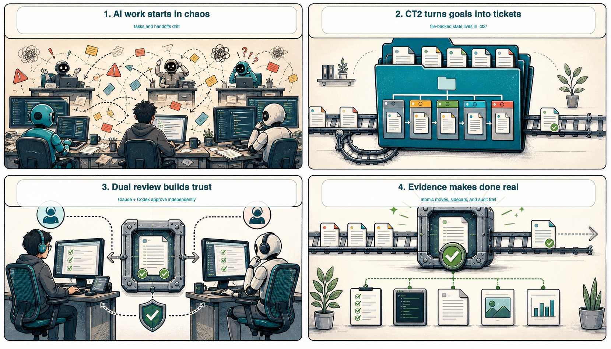
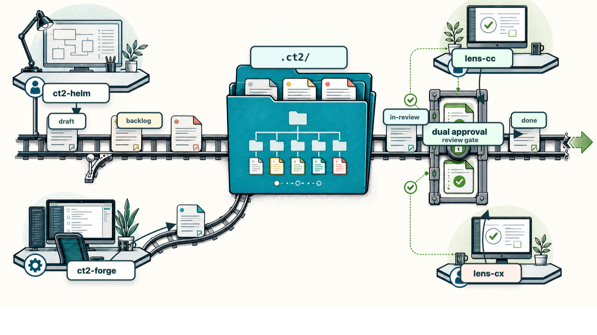
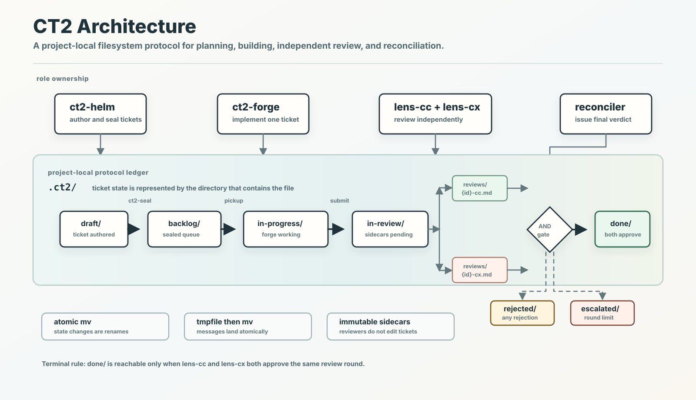
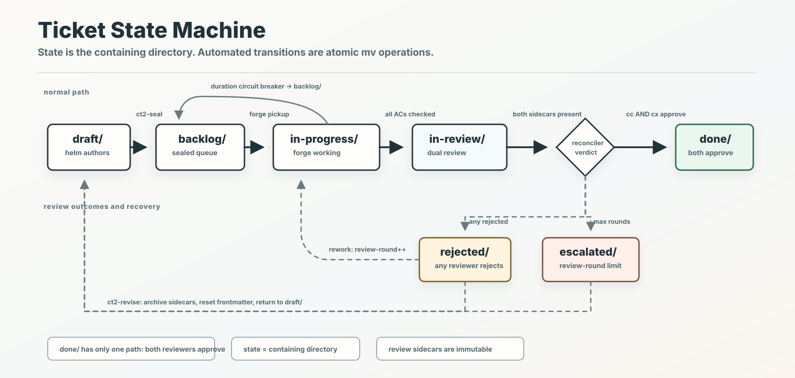

# CT2: Protocol for Multi-Agent Code Operations

**Protocol for multi-agent code operations with dual-review workflow.**



CT2 gives multiple AI agent sessions a shared project-local ledger. Planner,
engineer, and reviewer roles communicate through `.ct2/`, follow a Kanban-style
ticket state machine, and use dual independent review before a ticket reaches
`done/`.



Agent runtimes own continuation through their native goal, background, or task
features. CT2 supplies the protocol files, one-shot tools, and adapter prompts
those runtimes follow.

## Architecture



CT2 treats the project-local `.ct2/` directory as the coordination protocol:
tickets move between state directories with atomic `mv`, agents write durable
sidecar files, and the reconciler is the only automatic path into terminal
states.

**Key design decisions:**

- **File as source of truth** — all state lives in `.ct2/`; no databases, sockets, or message queues
- **Atomic `mv` for state transitions** — eliminates race conditions between concurrent sessions
- **Dual-approval review** — Claude and Codex review independently; both must approve
- **Immutable sidecar verdicts** — reviewers write to `reviews/`, never modify ticket files
- **Zero git footprint** — `.ct2/` is excluded via `.git/info/exclude`, not `.gitignore`

## Quickstart

### Install

```bash
git clone https://github.com/alohays/ct2 ~/.ct2
bash ~/.ct2/install.sh
source ~/.zshrc
```

### Initialize a project

```bash
cd /path/to/your/project
ct2-init
```

### Start sessions

Open separate terminal sessions for each role:

```bash
# Session 1: Planner (interactive)
claude
/ct2:helm

# Session 2: Engineer (autonomous)
claude
/ct2:forge

# Session 3: Claude reviewer (autonomous)
claude
/ct2:lens-cc

# Session 4: Codex reviewer (adapter dispatcher)
cd /path/to/your/project
ct2-lens-cx
```

The lens dispatchers read `adapters/{agent}/{role}.md` and invoke the selected
runtime. Use `ct2-lens-cx --dry-run` or `ct2-lens-cc --dry-run` to inspect the
chosen adapter command without starting an agent.

For Codex-first operation, run the preflight after initialization:

```bash
ct2-codex-doctor
```

It verifies the installed Codex CLI, `/goal` feature flag, app-server schema,
request-input support, MCP list, skill installation, and adapter fallback
requirements. Use `ct2-codex-doctor --enable-request-input` when you want CT2
to enable Codex's `default_mode_request_user_input` feature through the Codex
feature command surface.

### Workflow

1. **Plan** — `/ct2:helm` helps you author tickets in `.ct2/draft/`, optionally
   through an interactive HTML planning canvas (see below)
2. **Seal** — `ct2-seal 001` validates and moves the ticket to `backlog/`
3. **Build** — `ct2-forge` picks up the ticket and implements it autonomously
4. **Review** — `ct2-lens-cc` and `ct2-lens-cx` review independently
5. **Reconcile** — when both approve, the ticket moves to `done/`

### Planning canvas

`ct2-helm` can turn a planning conversation into a self-contained HTML page —
the Helm Canvas — so you decide scope, ticket split, acceptance criteria,
priority, and constraints visually instead of through a long question stream.

```bash
ct2-helm-canvas generate --spec spec.json      # writes .ct2/plans/canvas/open/*.canvas.html
# open the printed path in a browser, edit the panels, confirm the decision
ct2-helm-canvas recover '<CT2-DECISION token>' # records the decision, open/ -> answered/
ct2-helm-canvas seal <ticket>                  # after ct2-seal: answered/ -> sealed/
```

The canvas is the HTML provider format of a `.ct2/decisions/` record — the JSON
stays the source of truth. It references no external assets, returns its result
as a copy-paste token (or a downloaded file), and runs no server: every
`ct2-helm-canvas` subcommand is one-shot. See
[`spec/helm-canvas.md`](spec/helm-canvas.md).

### Running Adapter Reviewers

`ct2-lens-cx` and `ct2-lens-cc` are thin dispatchers. They select an adapter,
load its objective, and hand continuation to the agent runtime. CT2 does not
run a polling daemon.

```bash
ct2-lens-cx --dry-run
ct2-lens-cx --agent codex
ct2-lens-cc --agent claude
ct2-reconcile --discover
```

Each reviewer writes only its own sidecar. After a sidecar is written, the
reviewer calls `ct2-reconcile {id} {round}`; discovery mode finishes any
ticket-round where both sidecars exist but an agent forgot the explicit call.

**Verify Codex skill installation**

After `install.sh`, confirm the skill symlinks:

```bash
ls -la ~/.codex/skills/ct2-helm
ls -la ~/.codex/skills/ct2-forge
ls -la ~/.codex/skills/ct2-lens-cx
ls -la ~/.codex/skills/ct2-helm-auto-cx
ls -la ~/.codex/skills/ct2-status
```

If missing, re-run `bash ~/.ct2/install.sh` — it's idempotent.

CT2 also ships local Codex plugin metadata at
`codex-plugin/.codex-plugin/plugin.json` and marketplace metadata at
`.agents/plugins/marketplace.json` for Codex plugin workflows.

### Codex goals

Use `ct2-codex-goal` to create CT2-local goal metadata before starting a
long-running Codex role. This captures the ticket scope that makes phrases like
"current tickets" auditable after terminal restarts.

```bash
ct2-codex-goal start ct2-forge "Complete the current CT2 ticket set"
ct2-codex-goal status
ct2-codex-goal pause <goal-slug> ct2-forge
ct2-codex-goal resume <goal-slug> ct2-forge
ct2-codex-goal clear <goal-slug> ct2-forge
```

Then start Codex, set the matching `/goal` objective, and invoke the relevant
skill (`$ct2:helm`, `$ct2:forge`, `$ct2:lens-cx`, `$ct2:helm-auto-cx`, or
`$ct2:status`). Codex goal completion is advisory only; tickets reach `done/`
only through dual approval and the CT2 reconciler.

For app-server control, `ct2-codex-app-driver` can start, resume, or fork a
Codex thread over `stdio://`, set/read/clear the thread goal, optionally start
one turn, fail closed on approvals, map `requestUserInput` to supplied answers
or CT2 inbox fallback, and persist thread/goal metadata under `.ct2/codex/`.

```bash
ct2-codex-app-driver ct2-status "Inspect current CT2 state" --sandbox read-only
ct2-codex-app-driver ct2-forge "Complete current tickets" --resume --turn '$ct2:forge'
```

## CLI Commands

| Command | Description |
|---------|-------------|
| `ct2-init [dir]` | Initialize `.ct2/` in a project directory (prompts for git strategy on first run) |
| `ct2-seal <ticket>` | Validate and move a draft ticket to backlog |
| `ct2-revise <ticket>` | Archive past sidecars and return an escalated/rejected ticket to `draft/` |
| `ct2-helm-canvas <sub> ...` | Generate, recover, seal, or expire a helm planning canvas (`spec/helm-canvas.md`) |
| `ct2-status [dir]` | Display Kanban board, filesystem workflow summary, and inbox |
| `ct2-codex-doctor [dir]` | Preflight installed Codex capabilities and write `.ct2/codex/preflight.json` |
| `ct2-runtime-doctor [dir]` | Probe Codex/Claude/local runtime capabilities and write `.ct2/runtime/capabilities.json` |
| `ct2-baseline [dir]` | Compute the Trust/Evidence/Autonomy/Cost balanced scorecard baseline |
| `ct2-role-run --role <role> -- <cmd>` | Run a role command and append cost/latency telemetry |
| `ct2-cost [dir]` | Summarize `.ct2/telemetry/cost.jsonl` |
| `ct2-evidence ...` | Record stable command, artifact, screenshot, verifier, and hook-event evidence claims |
| `ct2-decision ...` | Create, format, and answer provider-neutral decision bridge records |
| `ct2-policy-compile [dir]` | Emit provider hook declarations and shell validator metadata |
| `ct2-bridge notify ...` | Send notify-only external advisory messages into CT2 inboxes |
| `ct2-plan-audit [dir]` | Verify tickets in active/review/done states have plan evidence or plan-exempt reason |
| `ct2-ticket-audit [dir]` | Audit per-ticket state, plan, review sidecar, and evidence readiness |
| `ct2-role-eval [dir]` | Run fixed role-definition eval cases and record role regression results |
| `ct2-vao-pilot [--report-file <path>]` | Run the local VAO phase-completion pilot and preserve runtime evidence |
| `ct2-vao-self-verify [--run-checks]` | Measure VAO completion gates from the self-verification criteria |
| `ct2-codex-goal ...` | Create, inspect, pause, resume, and clear CT2-local Codex goal metadata |
| `ct2-codex-app-driver ...` | Drive Codex app-server thread, goal, turn, request-input, approvals, logs, and metadata |
| `ct2-reconcile <ticket-id> <round>` | Reconcile independent review sidecars into terminal review state |
| `ct2-reconcile --discover [dir]` | Discover complete sidecar pairs and reconcile them |
| `ct2-lens-cc [dir]` | Dispatch lens-cc through an agent adapter |
| `ct2-lens-cx [dir]` | Dispatch lens-cx through an agent adapter |
| `ct2-git-start <ticket>` | Internal. Create/checkout the ticket's branch (called by forge on pickup) |
| `ct2-git-submit <ticket>` | Internal. Push the branch and open/update the PR (called by forge at in-review) |
| `ct2-git-finalize <verdict> <ticket>` | Internal. Merge/comment on PR per reconciler verdict |
| `ct2-git-cleanup <ticket>` | Internal. Close PR and delete the branch (called by `ct2-revise`) |

## Development Checks

Codex support has stdlib-only regression tests that exercise the CT2/Codex
contract without requiring a live Codex app-server:

```bash
PYTHONDONTWRITEBYTECODE=1 python3 bin/ct2-vao-self-verify --run-checks --json --repo .
python3 -m unittest discover -s tests
python3 -m unittest discover -s tests -p 'test_script_syntax.py'
python3 -m json.tool codex-plugin/.codex-plugin/plugin.json >/dev/null
python3 -m json.tool .agents/plugins/marketplace.json >/dev/null
git diff --check
```

The self-verifier and `test_script_syntax.py` discover Python helpers and Bash
entrypoints dynamically, so new scripts are automatically covered without
updating a copied command list.

The unittest suite covers Codex goal scope/audit behavior, request-input
fallbacks, fake-Codex preflight parsing, sidecar validation, `ct2-status`
Codex metadata output, and plugin/skill contract shape.

## Agent Skills

| Skill | Role | Loop | Description |
|-------|------|------|-------------|
| `/ct2:helm` | Planner | OFF | Interactive ticket authoring and management |
| `/ct2:forge` | Engineer | ON | Autonomous backlog processing |
| `/ct2:lens-cc` | Reviewer | ON | Idempotent review scan and verdict writing |
| `$ct2:helm` | Codex planner | OFF | Codex-native ticket authoring and clarification |
| `$ct2:forge` | Codex engineer | ON | Codex-native ticket implementation and goal-scope draining |
| `ct2:lens-cx` / `$ct2:lens-cx` | Codex reviewer | ON | Codex adapter review scan and verdict writing |
| `$ct2:helm-auto-cx` | Codex planner | ON | Goal-driven autonomous repository-improvement ticket planning |
| `/ct2:status` / `$ct2:status` | Monitor | — | One-shot state query |

## State Machine



- **`done`** is reachable only when both reviewers approve.
- **`escalated`** triggers when `max_review_rounds` is exceeded — requires human
  intervention via `ct2-revise`, which archives past review sidecars and
  returns the ticket to `draft/` for rework.
- **Duration circuit breaker**: if forge holds a ticket longer than
  `max_ticket_duration_min`, it is bounced back to `backlog/` automatically.
  Timer is driven by `.ct2/.meta/{id}.started`, not the ticket file's mtime.
- All transitions are atomic `mv` operations.

## Specifications

Full protocol specifications are in [`spec/`](spec/):

| Document | Description |
|----------|-------------|
| [`spec/directory-structure.md`](spec/directory-structure.md) | `.ct2/` layout |
| [`spec/PROTOCOL.md`](spec/PROTOCOL.md) | Top-level CT2 protocol anchor |
| [`spec/ticket-format.md`](spec/ticket-format.md) | Ticket YAML frontmatter and body format |
| [`spec/state-machine.md`](spec/state-machine.md) | Kanban state transition rules |
| [`spec/review-protocol.md`](spec/review-protocol.md) | Dual-approval, inbox, and reconciler protocol |
| [`spec/sidecar-format.md`](spec/sidecar-format.md) | Review sidecar contract |
| [`spec/reconciler.md`](spec/reconciler.md) | `ct2-reconcile` contract |
| [`spec/adapter-format.md`](spec/adapter-format.md) | Agent adapter markdown contract |
| [`spec/conformance.md`](spec/conformance.md) | Conformance rules and verification expectations |
| [`spec/helm-canvas.md`](spec/helm-canvas.md) | Helm planning canvas — HTML provider format and lifecycle |
| [`spec/git-workflow.md`](spec/git-workflow.md) | Git branch, commit, PR, and merge lifecycle |
| [`spec/codex-full-support-prd.md`](spec/codex-full-support-prd.md) | Product requirements for first-class Codex support |
| [`spec/codex-runtime-contract.md`](spec/codex-runtime-contract.md) | Technical contract for Codex CLI, `/goal`, app-server, skills, MCP, and request-input integration |

## Product Planning

| Document | Description |
|----------|-------------|
| [`docs/agent-platform-feature-radar-2026-05.md`](docs/agent-platform-feature-radar-2026-05.md) | 2026-05 Codex CLI and Claude Code feature radar, release-note analysis, and CT2 product roadmap proposals |
| [`docs/ct2-product-strategy-2026-05.md`](docs/ct2-product-strategy-2026-05.md) | Bet/risk strategy for CT2 product direction |
| [`docs/ct2-verified-autonomy-os-strategy-2026-05.md`](docs/ct2-verified-autonomy-os-strategy-2026-05.md) | Canonical Verified Autonomy OS integrated plan |
| [`docs/ct2-phase0-bet1-readiness-2026-05.md`](docs/ct2-phase0-bet1-readiness-2026-05.md) | Phase 0 readiness and Bet 1 go/no-go report |
| [`docs/ct2-native-task-mirror-spike-2026-05.md`](docs/ct2-native-task-mirror-spike-2026-05.md) | Advisory-only native task mirror spike result |
| [`docs/ct2-vao-completion-audit-2026-05-11.md`](docs/ct2-vao-completion-audit-2026-05-11.md) | Prompt-to-artifact completion audit for the VAO implementation |
| [`docs/ct2-vao-self-verification-criteria-2026-05-11.md`](docs/ct2-vao-self-verification-criteria-2026-05-11.md) | Measurable checklist and metrics for judging VAO completion/documentation quality |
| [`docs/ct2-vao-full-implementation-self-review-criteria-2026-05-11.md`](docs/ct2-vao-full-implementation-self-review-criteria-2026-05-11.md) | Strict multi-layer self-review checklist and measurable metrics for full VAO implementation claims |
| [`docs/ct2-vao-self-verification-report-2026-05-11.md`](docs/ct2-vao-self-verification-report-2026-05-11.md) | Executed self-verification report with gate scores and caveats |
| [`docs/ct2-verified-autonomy-os-full-phase-audit-2026-05-11.md`](docs/ct2-verified-autonomy-os-full-phase-audit-2026-05-11.md) | Full strategy phase audit confirming local phase-exit evidence and separating it from production claims |
| [`docs/ct2-vao-phase-completion-report-2026-05-11.md`](docs/ct2-vao-phase-completion-report-2026-05-11.md) | Local pilot report showing every VAO phase gate completed with runtime evidence |
| [`docs/ct2-helm-canvas-plan-2026-05.md`](docs/ct2-helm-canvas-plan-2026-05.md) | Helm Canvas development plan — HTML planning GUI direction and phased roadmap |

## Requirements

- macOS (primary target) or Linux
- Python 3.9+
- Git 2.5+
- [Claude Code](https://claude.ai/claude-code) (for helm, forge, lens-cc roles)
- [Codex CLI](https://github.com/openai/codex) 0.128.0+ (for Codex role skills, goal/app-server preflight, and lens-cx)

## License

[MIT](LICENSE)
