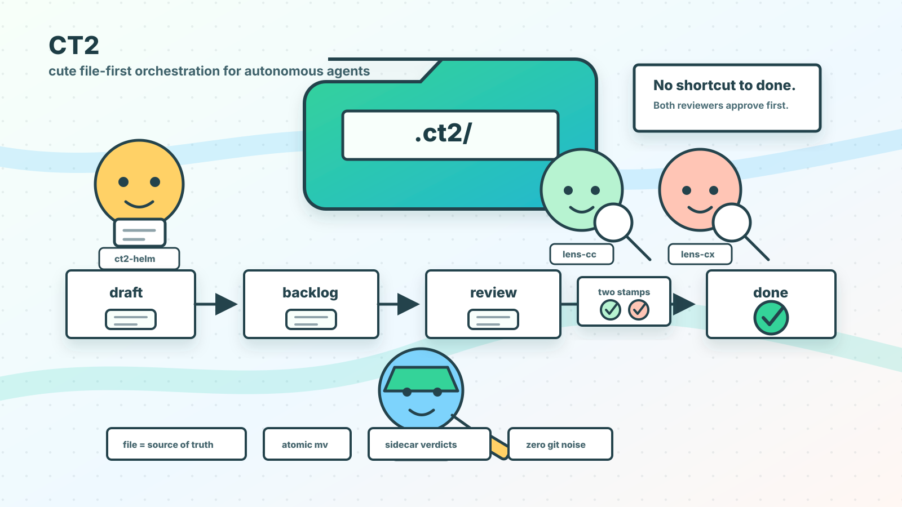
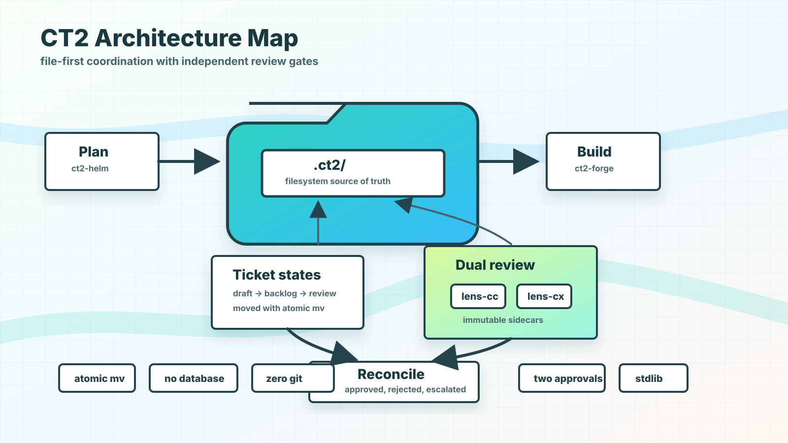

# CT2: Context Control Protocol

**Multi-session AI orchestration harness with dual-review workflow.**



CT2 enables multiple AI agent sessions to divide responsibilities and perform long-running autonomous development on a shared codebase. Three role-based sessions — planner, engineer, and reviewer — communicate through a shared `.ct2/` directory, following a Kanban-style ticket state machine and a dual-approval review protocol.

While the user is away, engineer and reviewer sessions autonomously process tickets. The user can plan new work or inspect results at any time through a planner session.

## Architecture



```
User
  │
  ▼
ct2-helm (planner)            ← Interactive: dialogue with user, author tickets
  │ ct2-seal
  ▼
.ct2/backlog/                 ← Shared filesystem (single source of truth)
  │
  ▼
ct2-forge (engineer)          ← Autonomous: picks up tickets, implements, submits
  │
  ▼
.ct2/in-review/
  │
  ├─────────────────────┐
  ▼                     ▼
ct2-lens-cc           ct2-lens-cx
(Claude Code)         (Codex CLI)
  │                     │
  ▼                     ▼
reviews/{id}-cc.md    reviews/{id}-cx.md
  │                     │
  └────────┬────────────┘
           ▼
     reconciler
           │
     ┌─────┼──────────┐
     ▼     ▼          ▼
   done  rejected  escalated
```

**Key design decisions:**

- **File as source of truth** — all state lives in `.ct2/`; no databases, sockets, or message queues
- **Atomic `mv` for state transitions** — eliminates race conditions between concurrent sessions
- **Dual-approval review** — Claude and Codex review independently; both must approve
- **Immutable sidecar verdicts** — reviewers write to `reviews/`, never modify ticket files
- **Zero git footprint** — `.ct2/` is excluded via `.git/info/exclude`, not `.gitignore`

## Quickstart

### Install

```bash
git clone https://github.com/alohays/ct2 ~/.ct2
bash ~/.ct2/install.sh
source ~/.zshrc
```

### Initialize a project

```bash
cd /path/to/your/project
ct2-init
```

### Start sessions

Open separate terminal sessions for each role:

```bash
# Session 1: Planner (interactive)
claude
/ct2:helm

# Session 2: Engineer (autonomous)
claude
/ct2:forge

# Session 3: Claude reviewer (autonomous)
claude
/ct2:lens-cc

# Session 4: Codex reviewer (visible TUI)
cd /path/to/your/project
ct2-lens-cx-tui
```

See [Running the Codex TUI reviewer](#running-the-codex-tui-reviewer) below
for attach/detach, tuning, and known Codex quirks.

### Workflow

1. **Plan** — `/ct2:helm` helps you author tickets in `.ct2/draft/`
2. **Seal** — `ct2-seal 001` validates and moves the ticket to `backlog/`
3. **Build** — `ct2-forge` picks up the ticket and implements it autonomously
4. **Review** — `ct2-lens-cc` and `ct2-lens-cx` review independently
5. **Reconcile** — when both approve, the ticket moves to `done/`

### Running the Codex TUI reviewer

`ct2-lens-cx-tui` is the primary lens-cx path. It launches a tmux session
with two panes:

- **Main pane** — interactive Codex TUI where reviews happen live
- **Bottom pane (10 rows)** — scheduler log with tick timing, heartbeat
  probes, and context resets

The scheduler reads `lens_cx.poll_interval_sec` from
`.ct2/config/harness.yaml` (default 180s) and injects a `ct2:lens-cx` review
tick into the Codex pane every interval, so you can watch each scan and
review iteration happen in real time.

**Operational basics**

From a plain terminal, `ct2-lens-cx-tui` attaches to the CT2 tmux session. If
you run it from inside an existing tmux client, it switches that client to the
CT2 session instead of nesting tmux. Use `--no-attach` to start or reuse the
session without attaching or switching.

```bash
# Detach (leave the session running in the background)
Ctrl-B d

# Re-attach — the same command re-attaches an existing session
ct2-lens-cx-tui /path/to/your/project

# Stop cleanly (session name prints on startup; or use tmux ls)
tmux kill-session -t ct2-lens-cx-<slug>-<hash>
```

**Tunable environment variables**

| Variable | Default | Purpose |
|---|---|---|
| `CT2_LENS_CX_TUI_INTERVAL` | harness / `180` | Tick interval in seconds |
| `CT2_LENS_CX_TUI_INITIAL_DELAY` | `8` | Wait before first tick (lets Codex TUI finish starting) |
| `CT2_LENS_CX_TUI_MAX_TICKS` | `500` | Driver exits after N ticks to bound Codex context growth (`0` disables) |
| `CT2_LENS_CX_TUI_CLEAR_EVERY` | `50` | Inject `/clear` every Nth tick to recycle context (`0` disables) |
| `CT2_CODEX_CMD` | `codex` | Codex CLI executable |
| `CT2_CODEX_ARGS` | `--sandbox workspace-write` | Codex startup flags |

**Known limitations (Codex 0.121.0)**

- `/ct2:lens-cx` is not a native Codex slash command. The driver pastes
  `$ct2:lens-cx` as a skill mention plus inline fallback instructions, so
  the reviewer works whether or not skill dispatch fires.
- Codex rejects `--add-dir` under `--sandbox read-only`. The TUI defaults to
  `workspace-write`; the reviewer role forbids source-file edits at the
  text-policy level.
- `ct2-lens-cx-daemon` remains available for unattended operation (launchd
  or `nohup`) and invokes `codex exec` non-interactively.

**Verify Codex skill installation**

After `install.sh`, confirm the skill symlink:

```bash
ls -la ~/.codex/skills/ct2-lens-cx
```

If missing, re-run `bash ~/.ct2/install.sh` — it's idempotent.

## CLI Commands

| Command | Description |
|---------|-------------|
| `ct2-init [dir]` | Initialize `.ct2/` in a project directory (prompts for git strategy on first run) |
| `ct2-seal <ticket>` | Validate and move a draft ticket to backlog |
| `ct2-revise <ticket>` | Archive past sidecars and return an escalated/rejected ticket to `draft/` |
| `ct2-status [dir]` | Display Kanban board, agent heartbeats, and inbox |
| `ct2-lens-cx-tui <dir>` | Start the visible Codex TUI reviewer loop |
| `ct2-lens-cx-daemon <dir>` | Start the legacy headless Codex reviewer polling daemon |
| `ct2-git-start <ticket>` | Internal. Create/checkout the ticket's branch (called by forge on pickup) |
| `ct2-git-submit <ticket>` | Internal. Push the branch and open/update the PR (called by forge at in-review) |
| `ct2-git-finalize <verdict> <ticket>` | Internal. Merge/comment on PR per reconciler verdict |
| `ct2-git-cleanup <ticket>` | Internal. Close PR and delete the branch (called by `ct2-revise`) |

## Agent Skills

| Skill | Role | Loop | Description |
|-------|------|------|-------------|
| `/ct2:helm` | Planner | OFF | Interactive ticket authoring and management |
| `/ct2:forge` | Engineer | ON | Autonomous backlog processing |
| `/ct2:lens-cc` | Reviewer | ON | Idempotent review scan and verdict writing |
| `ct2:lens-cx` | Reviewer | ON | Codex TUI review scan and verdict writing |
| `/ct2:status` | Monitor | — | One-shot state query |

## State Machine

```
  ┌──────────────────────── ct2-revise ────────────────────────┐
  │                        (human-triggered)                    │
  ▼                                                             │
draft → backlog → in-progress → in-review → done                │
                      ▲             │                           │
                      │             ▼                           │
                      │         ┌────────┴──────┐               │
                      │         ▼               ▼               │
                      │      rejected ───► in-progress          │
                      │     (rework cycle, review-round++)      │
                      │                                         │
                      └── duration CB bounce (backlog)          │
                                                                │
                              escalated ─────────────────── ────┘
                              (max_review_rounds)
```

- **`done`** is reachable only when both reviewers approve.
- **`escalated`** triggers when `max_review_rounds` is exceeded — requires human
  intervention via `ct2-revise`, which archives past review sidecars and
  returns the ticket to `draft/` for rework.
- **Duration circuit breaker**: if forge holds a ticket longer than
  `max_ticket_duration_min`, it is bounced back to `backlog/` automatically.
  Timer is driven by `.ct2/.meta/{id}.started`, not the ticket file's mtime.
- All transitions are atomic `mv` operations.

## Specifications

Full protocol specifications are in [`spec/`](spec/):

| Document | Description |
|----------|-------------|
| [`spec/directory-structure.md`](spec/directory-structure.md) | `.ct2/` layout |
| [`spec/ticket-format.md`](spec/ticket-format.md) | Ticket YAML frontmatter and body format |
| [`spec/state-machine.md`](spec/state-machine.md) | Kanban state transition rules |
| [`spec/review-protocol.md`](spec/review-protocol.md) | Dual-approval, inbox, and reconciler protocol |

## Requirements

- macOS (primary target) or Linux
- Python 3.9+
- Git 2.5+
- tmux (for the visible Codex reviewer loop)
- [Claude Code](https://claude.ai/claude-code) (for helm, forge, lens-cc roles)
- [Codex CLI](https://github.com/openai/codex) (for lens-cx reviewer, optional)

## License

[MIT](LICENSE)
