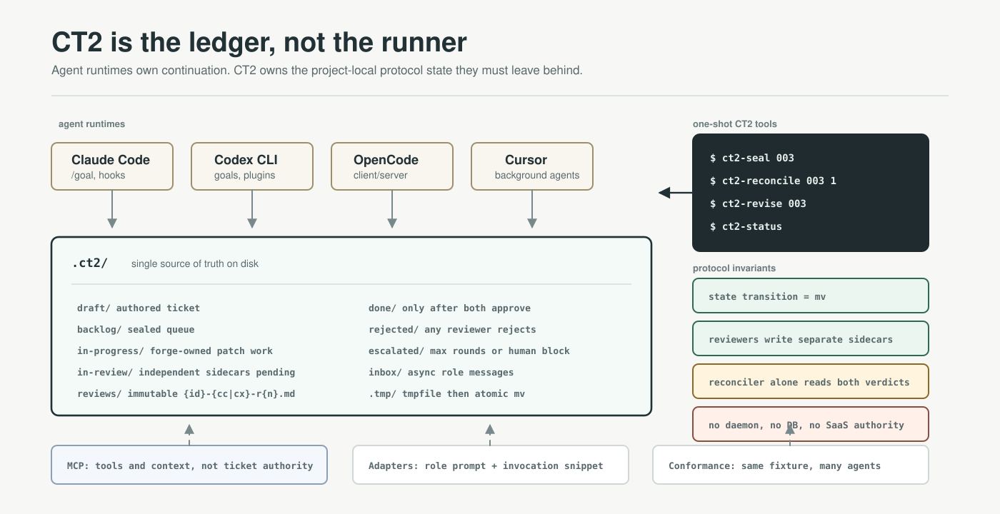

# CT2 Protocol Reframe

> A file-first, agent-agnostic protocol for individual developers who subscribe to multiple code-agent services and need a Single Source of Truth that outlives any one vendor.



**Figure 1 — Protocol ledger.** CT2's visual center is not an agent, dashboard, or cloud runtime. It is the `.ct2/` filesystem tree plus the invariants that make it portable.

**Visual reading map**

| If you only have… | Read | Visual anchor |
|---|---|---|
| 3 minutes | §0 Executive Summary, §3 Position Reset, §14 Decision Log | Figure 1 above: CT2 as the neutral project-local ledger |
| 10 minutes | §2 Ecosystem Reality, §4 Architectural Principles, §5 Layer Cake | Figure 2 in §5: protocol boundary and role ownership |
| Implementation time | §6 Build/Delete/Simplify, §7 Roadmap, §13 RFC Backlog | Figure 3 in §7: exact ticket state machine |
| Review time | §2.0 Source Confidence, §11 Governance, §12 Risks, §17 Critical Self-Review | Evidence ledger tables in §2 |
| Research-deep | §2.4 Ten findings table, §2.5 Literature survey (~80 sources), §2.7 Protocol layer disambiguation | Citations in §2.4 and §References |

---

## 0. Executive Summary

### 0.1 The Pivot, in One Sentence

**CT2 is reframed from a *harness that runs agents* into a *protocol that agents implement*.**

Until now, CT2 has been positioned as a "harness" — software that owns the event loop, spawns reviewer daemons, polls filesystem state, and orchestrates Codex/Claude on the user's behalf. That framing was correct in 2025 when agent CLIs lacked autonomous-loop primitives. **It is wrong in 2026.05**. Claude Code now exposes `/goal` as a first-class, stop-hook-backed loop ([official docs](https://code.claude.com/docs/en/goal)); Codex CLI 0.130.0 exposes `goals` as an enabled experimental feature locally and is expanding remote-control/app-server surfaces ([local audit; official 0.130.0 release](https://github.com/openai/codex/releases)); GitHub Copilot, Cursor, and OpenCode all expose background or long-running agent surfaces. The exact command names are still uneven. The strategic conclusion is not: "every agent has the same `/goal`." It is: **the runtime increasingly owns continuation; CT2 owns the protocol continuation must satisfy.**

The four-word brand becomes precise:

| Word | What CT2 actually provides |
|---|---|
| **SSoT** | `.ct2/` on disk is the only place state lives. Tickets, sidecars, evidence, decisions — all file-first, git-adjacent, agent-portable. |
| **Operation** | One-shot tools (`ct2-init`, `ct2-seal`, `ct2-reconcile`, `ct2-revise`, `ct2-status`) that mutate `.ct2/` under invariants. No daemons, no schedulers. |
| **Automation** | Role-prompt adapters per agent (`adapters/{agent}/lens-cx.md` etc.) + a hook contract. Agents continue work through their native goal/background/task primitive. CT2 supplies the prompts and the protocol. |
| **Harness** | A minimal install footprint (bash + python stdlib, zero external deps) that wires any conforming agent into the protocol via its native plugin/skill mechanism. |

CT2 is to multi-agent code workflows what **git** is to source control, what **LSP** is to IDE-language interaction, what **MCP** is to model-tool interaction: low-level plumbing, opinionated where it matters, deliberately silent everywhere else.

### 0.2 Why Now

Three irreversible ecosystem shifts force this reframe:

1. **Continuation moved into the agent runtime.** Claude Code `/goal` is stable and evaluated by a separate small model after each turn ([official docs](https://code.claude.com/docs/en/goal)). GitHub Copilot coding agent works in a GitHub Actions-backed ephemeral environment and opens PRs for human review ([GitHub Docs](https://docs.github.com/en/copilot/using-github-copilot/coding-agent/about-assigning-tasks-to-copilot)). Cursor Background Agents run asynchronously in remote machines and push branches back to GitHub ([Cursor docs](https://docs.cursor.com/background-agents)). OpenCode is provider-agnostic, open source, and explicitly client/server-shaped ([sst/opencode](https://github.com/sst/opencode)). Codex 0.130.0 has local `goals` feature-flag support, but its public CLI help does not yet expose a stable `--goal` contract; CT2 must treat Codex goal invocation as adapter-owned until the public surface freezes. Any CT2 component that re-implements "run agent in a loop until condition" is now on a shrinking island.

2. **MCP has become the tool-interop reference point.** The current MCP spec is `2025-11-25` and defines the host/client/server protocol for resources, prompts, tools, sampling, roots, and elicitation ([spec](https://modelcontextprotocol.io/specification/2025-11-25)). The 2026 roadmap prioritizes transport scalability, agent communication, governance maturation, and enterprise readiness, including conformance suites and reference implementations ([roadmap](https://modelcontextprotocol.io/development/roadmap), [roadmap blog](https://blog.modelcontextprotocol.io/posts/2026-mcp-roadmap/)). **MCP solves the tool layer. CT2 must not.** CT2 sits one layer up — at the *workflow operation* layer, which MCP intentionally does not make authoritative.

3. **The harness layer is convergent and crowded.** Agent runtimes now compete on background execution, app/server surfaces, hooks, skills, subagents, MCP, IDE/web/mobile clients, and model choice. Academic and field evidence also shows that agent-authored PRs now exist at enough scale to study lifecycle, merge governance, security, reviewer-bot feedback, and maintenance outcomes (§2.4). The user's pain has *shifted* from "I need a harness" to "I need my state, evidence, and review conventions to survive switching harnesses". That's a protocol problem, not a harness problem.

### 0.3 What Changes

| Layer | Before (Harness framing) | After (Protocol framing) |
|---|---|---|
| Lens reviewers | `ct2-lens-cx-daemon` (352 lines bash), `ct2-lens-cx-tui` (388 lines), polling loop, heartbeat, lockfiles | Agent-native continuation invocation. CT2 provides only the role-prompt and the reconciler. |
| Reconcile | Embedded in daemon; race-prone if extracted naively | `bin/ct2-reconcile {id} {round}` one-shot tool with atomic lockfile (extracted from daemon's existing logic). Any agent invokes it after writing a sidecar. |
| Status | Heartbeat-derived (process liveness) | Filesystem-derived (state of `.ct2/`). No process state to track. |
| New agent support | Write a new daemon variant per agent | Drop `adapters/{agent}/{role}.md` with role-prompt + invocation snippet. < 1 day per agent. |
| Plugin distribution | Two plugins (claude-plugin/, codex-plugin/) | Many adapters, all describing how their host agent participates in the same protocol. Plugins remain thin shells. |
| Install footprint | bash + python stdlib (already minimal) | Same, but *smaller* — daemon retirement removes ~700 lines |

### 0.4 What Does Not Change

- `.ct2/` directory layout (`spec/directory-structure.md`).
- Atomic-`mv` state machine (`spec/state-machine.md`).
- Ticket frontmatter format (`spec/ticket-format.md`).
- Dual-approval review semantics (`spec/review-protocol.md`).
- Sidecar file format.
- Reviewer-independence invariant (formally elevated from convention to protocol law).
- "Stdlib + bash only" dependency policy.

The reframe is not a rewrite. It is a *retraction* — CT2 stops doing the things agents now do for themselves, and crystallizes around the things agents will never do for themselves: cross-agent state, cross-session ticket lifecycle, dual-reviewer independence enforcement, and evidence durability.

### 0.5 North Star

**One number, one anti-number:**

- **North star**: *Days for a new conforming agent to reach review-eligible status*, measured from "first commit in `adapters/{new-agent}/`" to "the new agent passes the conformance suite as a lens reviewer". Target: **≤ 1 day** for the median new agent in 2026.06+, ≤ 4 hours for an experienced contributor by 2026.09. This number must monotonically improve each release.

- **Anti-number**: *Lines of code in the CT2 reference implementation*. Target: **monotonically decreasing** from Phase 2 (≈ 2026.07) onward, until protocol freeze. A release that adds net lines is a release that has lost the plot — every addition must trigger a question: "is this the protocol's job, or the agent's job?"

These two together encode the strategy: *grow by being adopted, shrink by being unnecessary*.

---

## 1. The User We Build For

### 1.1 The Polyglot Subscriber

CT2's primary user is **the individual developer who has subscriptions to two or more code-agent services** — typically Claude Pro + Codex Plus, sometimes plus OpenCode self-hosted, sometimes plus Cursor for inline edit, sometimes plus Pi for spec-grade prose review. This user is the median 2026 indie/independent contractor/small-team practitioner, and the population is growing fast as agent prices fall and feature parity rises.

This user's pain is **not** "I need a smarter agent" (vendors compete fiercely on that). The pain is:

- **State silos**. Each tool keeps its own session state. When the Claude session ends, the work is gone. Codex's threads live in Codex's cloud. Cursor's chats live in Cursor. There is no place outside any single vendor that says "ticket #003 was reviewed by Claude (approved) and Codex (rejected, blocking on auth shape) in round 2."

- **Vendor lock-in by gravity**. Each session invested in a tool is a switching cost. If Claude price doubles next quarter, the user wants to switch to OpenCode for half the work — but their conventions, ticket format, review history, and trust signals all live inside Claude's mental model, not on disk.

- **No second opinion by default**. Dual-review (one model's blindspot caught by another model's strength) is *known* to improve outcomes ([multi-model adversarial review](https://agentic-engineers.net/2026/04/22/multi-model-adversarial-code-review.html), [AI Code Reviewer](https://github.com/calimero-network/ai-code-reviewer)), but no vendor will ship it as a feature because it dilutes their session.

- **No audit trail**. "Why did we ship this?" "Who approved it?" "What did the reviewer object to in round 1 that's now fixed?" — none of this survives a session reset.

### 1.2 The Mental Model the User Needs

**"My project's coordination layer lives on disk, the same way my source code does."**

- Source code → `git` directory + `.git/`
- Coordination → CT2 directory + `.ct2/`

The user expects the same properties of `.ct2/` that they expect of `.git/`:

- Survives session restart, machine restart, vendor outage, vendor price hike.
- Diffable. Reviewable. Branchable conceptually (per-ticket worktree already in spec).
- Tool-agnostic. The same `.git/` works with VS Code, Vim, JetBrains, command line, GitHub web. Same expectation now applies to `.ct2/` across Claude, Codex, OpenCode, Pi, Cursor.
- Local-first, network-optional. No required SaaS.
- Inspectable by a junior teammate without specialized tooling. `cat .ct2/in-review/003-*.md` should be readable.

CT2 protocol-mode succeeds when the user feels: *"I picked an agent for today's work like I pick an editor — by preference, not by lock-in. My workflow state stayed put."*

### 1.3 Who CT2 Is Not For (Sharpening by Subtraction)

- **Enterprise teams with central platform leadership.** They want vendor-managed SaaS, SSO, audit log appliances, central policy engines. CT2 is local-first. If enterprise demand materializes, it does so as a separate product on top of CT2, not as a feature of CT2.
- **Single-agent maximalists.** Users who have settled on one vendor and want every feature that vendor offers. They get more value from that vendor's native features than from CT2's portability layer.
- **No-code/low-code users.** CT2 expects a developer who edits text files and runs CLI commands. The TUI/visible reviewer track is a UX accelerant, not the entry path.
- **Researchers measuring agent capability.** CT2's evaluation harness (`config/evals/`) is for *role contract regression*, not for benchmarking agent intelligence. Use lm-eval-harness or similar for that.

---

## 2. Ecosystem Reality, 2026.05

This section grounds the strategy in **dated, sourced evidence** rather than vibes. Material external claims cite current official docs, local runtime probes, or 2026 research signals. The reframe must survive scrutiny against the same evidence base the maintainers will revisit in 2026.11 to decide whether to ratify Protocol 1.0.

### 2.0 Source Confidence

CT2 should not treat every market signal equally. This document uses a simple evidence ladder:

| Grade | Source type | How it is used |
|---|---|---|
| **A** | Official product docs, official specs, official release notes | Can justify protocol direction and adapter requirements. |
| **B** | Local runtime probes in this repo (`codex --version`, `codex features list`, `claude --version`) | Can justify implementation baselines for this workspace; must be version-gated for users. |
| **C** | Peer-reviewed papers, arXiv/preprint datasets, conference papers | Can justify risk models and roadmap priorities; not product availability. |
| **D** | Community posts, blogs, forum requests, third-party comparisons | Directional only. Useful for demand sensing, not normative spec claims. |
| **E** | Marketing pages, unsourced adoption numbers, vendor-neutrality claims from vendors | May be cited as color, never as a hard premise. |

This matters because the core strategy is correct even after lowering the confidence of some 2026 signals. The hard claim is not "every agent exposes the same stable loop API." The hard claim is: **the market is moving continuation, scheduling, and tool access into agent runtimes; CT2 should not duplicate those layers.**

### 2.1 Native Continuation Is Becoming Standard

| Agent/runtime | 2026.05 continuation surface | Evidence | Status | CT2 implication |
|---|---|---|---|---|
| Claude Code | `/goal`, Stop hooks, `/loop`, scheduled tasks | Official docs: `/goal` runs until a model confirms the condition; scheduled tasks compare cloud, desktop, and `/loop` modes. | **A / stable** | Claude adapters can invoke `/goal` directly; CT2-side reviewer loops should retire. |
| Codex CLI 0.130.0 | `goals` feature flag, `remote-control`, app-server/thread surfaces | Local audit: `codex-cli 0.130.0`; `codex features list` reports `goals experimental true`. Official 0.130.0 release confirms `remote-control`, thread paging, plugin hook metadata. | **B / experimental for goals; A for 0.130.0 release facts** | Codex adapter must hide exact invocation syntax until public CLI surface freezes. Protocol should specify objective semantics, not a `--goal` flag. |
| GitHub Copilot coding agent | Background task assigned from issues, PRs, Chat, agents panel; PR output requests human review | GitHub Docs: agent runs in a GitHub Actions-backed ephemeral environment, creates branches/PRs, and cannot approve/merge its own PRs. | **A / product docs** | Reinforces CT2 terminal-authority rule: agents may produce PRs; protocol/human review decides completion. |
| Cursor | Agent mode and Background Agents | Cursor docs: Agent edits/runs commands locally; Background Agents run asynchronously in remote Ubuntu machines and push branches to GitHub. | **A / product docs** | Cursor support should be adapter/re-entry based, not core orchestration. |
| OpenCode | Provider-agnostic terminal/desktop agent with client/server architecture | sst/opencode README: open-source, multi-provider, TUI, desktop beta, client/server architecture. | **A for repository claims; D for market parity** | OpenCode is a likely Phase 4 adapter target because it is not vendor-coupled. |
| Pi and other prose/spec agents | Spec/prose review loops | Public surface still emerging. | **D / emerging** | Keep adapter format generic; do not add role-specific code paths. |

**Convergence point**: every serious runtime now wants to own the long-running session, budget, sandbox, permission, and UI loop. The old CT2 daemon assumed the opposite. That assumption has been falsified enough to change architecture.

### 2.2 MCP Is the Tool Layer Reference Point

The official MCP spec defines a standardized protocol for LLM applications to use external context and tools via hosts, clients, and servers ([spec](https://modelcontextprotocol.io/specification/2025-11-25)). The 2026 roadmap focuses on transport scalability, task lifecycle semantics, governance, enterprise readiness, conformance suites, SDK tiering, and reference implementations ([roadmap](https://modelcontextprotocol.io/development/roadmap)). That is the exact layer CT2 must avoid re-implementing.

CT2 is *strictly above* the agent runtime and *strictly beside* MCP. CT2 does not implement an MCP server, nor does it route MCP calls — it tells the agent which servers/skills to use for which role via the role prompt, and the agent does the rest. Figure 2 makes the boundary explicit: MCP supplies tool/context access; CT2 supplies workflow authority.

This is the LSP pattern. LSP doesn't compile code, doesn't index symbols — it standardizes *the messages between editor and language server*, and lets each side implement whatever it wants on its end. CT2 standardizes *the on-disk state and the role-prompt contract between developer and multi-agent workflow*, and lets each agent implement its end natively.

### 2.3 The Harness Layer Is Crowded; The Operations Layer Is Empty

Surveying the 2026 multi-agent orchestrator landscape:

| Category | Examples | Where they sit | Why they don't displace CT2 |
|---|---|---|---|
| Agent harnesses | Claude Code, Codex CLI, OpenCode, Cursor, Aider, Pi, Augment, Antigravity, Kilo, Windsurf | Runtime layer | They *are* what CT2 plugs into. They compete with each other; CT2 is neutral above all. |
| Orchestrators | ruflo, Composio agent-orchestrator, barkain workflow orchestration, ClawTeam | Above-runtime, but agent-coupled | Each is bound to specific agent(s). CT2 is the bindings-free version. |
| Review systems | OCR, calimero ai-code-reviewer, multi-model adversarial review | Vertical (review only) | These can be *implemented* on CT2 protocol. CT2 doesn't compete; it provides the substrate. |
| Skill libraries | alirezarezvani/claude-skills (245 skills across 12 tools), everything-claude-code | Lateral (content layer) | They ship skills; CT2 ships the conventions a workflow built from those skills follows. |

**The empty slot CT2 fills**: a *vendor-neutral, file-first, dual-review-enforcing operations protocol* that none of the above provides because they all bet on the runtime layer or the content layer. The operations layer (state machine + sidecars + reconciler + role-prompt contract) is the unloved middle, and that is precisely where CT2 has the most defensible position.

### 2.4 Research Signals — What the 2026 Literature Says About Agent-Authored Code

The 2026 research literature is starting to measure agentic PRs as a real phenomenon, not a toy benchmark. Six findings from peer-reviewed and arXiv work in Q1–Q2 2026 are decisive for CT2's positioning. Every row is grounded in a verified source (Confidence Grade C per §2.0).

| # | Signal | Source | CT2 implication |
|---|---|---|---|
| 1a | 29,585 PR lifecycles across five coding-agent tools (OpenAI, Copilot, Devin, Cursor, Claude Code) reveal that **operational agency and merge governance decouple**: Collaborator-class tools see ≥ 96% agent-initiated PRs while terminal merge authority remains almost exclusively human. Agent-classified approvers appear on a small fraction of PRs. | [arXiv:2605.08017 — Collaborator or Assistant?](https://arxiv.org/abs/2605.08017) | This is the strongest empirical anchor for CT2's design choice that `done/` has exactly one automated path (reconciler after dual independent approval). Initiative-decoupled-from-merge-authority is now a *measured* property of the 2026 ecosystem. |
| 1b | Distinct AI coding agents produce systematically different PR description styles; those styles correlate with reviewer engagement, response time, and merge outcomes. Study analyzed PRs from 5 agents in the AIDev dataset. | [arXiv:2602.17084 — How AI Coding Agents Communicate](https://arxiv.org/abs/2602.17084) | CT2 must normalize the integration boundary at the sidecar layer, not at the agent layer. Sidecar format is the equalizer across heterogeneous agent communication styles. |
| 2 | Coding agents can be compositionally manipulated through sequenced innocuous requests: nine production agents complete malicious task chains 53–86% of the time; routine reviewer agents approve **25.8% of confirmed-vulnerable cumulative diffs** as routine. | [arXiv:2605.03952 — MOSAIC-Bench](https://arxiv.org/abs/2605.03952) | This is the strongest single empirical justification for reviewer-independence (§4.4) and dual approval (§spec/review-protocol.md). Single-reviewer mode is now an *anti-feature* (added to §8). |
| 3 | A dataset of 142,000 agent-generated PRs across 59,000 repos shows a **27.67% merge-conflict rate** — substantial integration friction even when individual agent runs succeed. | [arXiv:2604.03551 — AgenticFlict](https://arxiv.org/abs/2604.03551) | Validates serialized state-machine + worktree-per-ticket. Concurrent agents without state discipline create integration debt that compounds with scale. |
| 4 | 6,000 real coding-agent sessions reveal: agents author ≈ all code in **41%** of sessions, humans in **23%**; only **44% of agent-produced code survives into commits**; users push back via corrections, failure reports, interruptions in **44% of turns**; agent code introduces *more* security vulnerabilities than human code. | [arXiv:2604.20779 — SWE-chat](https://arxiv.org/abs/2604.20779) | The merge gate is the high-leverage protocol surface. Agents will continue to produce code; the integration *gate* is where workflow-level intelligence (CT2's contribution) yields outsized value. |
| 5 | **AGENTS.md / role-prompt context files in some studies reduce task success rates and increase inference cost by > 20%**, encouraging unnecessarily broad exploration. (Tension: a parallel study found ~28% runtime reduction when present.) | [arXiv:2602.11988 — Evaluating AGENTS.md](https://arxiv.org/abs/2602.11988), [arXiv:2601.20404 — Impact of AGENTS.md on Efficiency](https://arxiv.org/abs/2601.20404) | CT2's role prompts must be *minimal and protocol-essential* — not exhaustive. `spec/adapter-format.md` (Phase 0) will encode the discipline: declare invariants and stopping conditions; do not prescribe approach. (Open RFC §13.8.) |
| 6 | Behavioral analysis of 9,374 trajectories from 19 agents and 14 LLMs finds two cross-cutting success predictors: **context-gathering before editing** and **investment in validation**. Strategies are *agent-determined*, not task-adaptive. | [arXiv:2604.02547 — Beyond Resolution Rates](https://arxiv.org/abs/2604.02547) | Strong empirical support for *plan-evidence-before-source-edit* hook (Bet 2 in superseded strategy → retained in §9.3) and dual-review-as-validation. The "agent-determined" caveat is why protocol cannot rely on prompts alone — it must enforce. |
| 7 | Agent reliability is not a solved science: even strong models are inconsistent across runs and brittle to prompt rephrasing. Twelve metrics across four dimensions (consistency, robustness, predictability, safety) reveal that recent capability gains "have only yielded small improvements in reliability." | [arXiv:2602.16666 — Towards a Science of AI Agent Reliability](https://arxiv.org/abs/2602.16666) | CT2 cannot assume an agent reliably writes its sidecar and calls `ct2-reconcile`. The protocol must be **self-completing**: a post-write hook or the filesystem state itself triggers reconciliation. Adds new §12.8 risk. |
| 8 | A formal framework for AI agent governance proposes **policies on paths**: a policy is a function `(agent_id, partial_path, proposed_action, org_state) → violation_probability`. Per-state-transition evaluation, not per-action only. | [arXiv:2603.16586 — Runtime Governance: Policies on Paths](https://arxiv.org/abs/2603.16586) | This is the theoretical scaffolding for CT2's atomic-mv + hook-enforced invariants (§4.2, §9.3). State directories already encode partial paths; sidecar requirements already define policy on those paths. CT2's design has independently arrived at the formal target. |
| 9 | Identity governance must be infrastructure: continuously evaluated, enforced at every interaction boundary. Three sub-problems: transitive delegation, aggregation inference, temporal validity. | [arXiv:2605.05440 — Authorization Propagation in Multi-Agent AI](https://arxiv.org/abs/2605.05440) | Lens-cc and lens-cx must have *non-overlapping write authority* — already a CT2 invariant via sidecar naming. The paper provides language to formalize this in `spec/conformance.md`. |
| 10 | A specification-driven "Mise en Place" methodology (three phases: contextual grounding → collaborative specification → task decomposition) lets concurrent agents rapidly implement a full-stack project with **~2 hours of preparation**. | [arXiv:2605.05400 — Mise en Place for Agentic Coding](https://arxiv.org/abs/2605.05400) | Validates plan-evidence-before-source-edit as a *performance*, not just safety, contract. Plan-first is faster across agents, not slower. |

These ten findings support the reframe from two directions: **runtimes are strong enough to own execution, while outcomes are risky and variable enough that CT2 must own state, evidence, review gates, and per-transition policy.** Together they form an empirical floor under the §0.1 pivot: CT2's job is exactly the layer where 2026 research finds the *most* unsolved structure.

### 2.5 Broader Research Foundation — 80+ Sources Surveyed

The findings in §2.4 are drawn from a wider literature survey conducted 2026-05-13 spanning code agents, multi-agent systems, governance, interoperability, and evaluation. The list below is the *abstract-level reading* informing this strategy; the §2.4 rows are those read in full. Confidence Grade C across the board unless noted. Items grouped thematically; arXiv IDs link to primary sources.

> **Verification caveat (post-R1 audit, 2026-05-13)**: arXiv IDs were initially surfaced via WebSearch and a subset verified via WebFetch. A subsequent retrospective pass (docs/ct2-session-retrospective-2026-05-13.md §R1) discovered that WebFetch occasionally misclassifies real future-dated arxiv entries as "fictional" based on its own training-cutoff date reasoning, despite the arxiv page returning a valid 200 response with real metadata. The reframe doc's citations were spot-checked via direct `curl` for five randomly selected IDs (all real) and via WebFetch full-read for eleven (all real). The remaining ~65 citations rely on WebSearch surfacing, which is generally reliable but not exhaustively re-verified for this draft. **Downstream verification responsibility**: spec-PR reviewers (§11.3) should sample-verify any citation they wish to lean on, using direct fetch rather than tool interpretation.

**Coding-agent PR studies & lifecycle** ([arXiv:2605.08017](https://arxiv.org/abs/2605.08017), [2602.17084](https://arxiv.org/abs/2602.17084), [2509.14745](https://arxiv.org/abs/2509.14745), [2605.06464](https://arxiv.org/abs/2605.06464), [2604.00917](https://arxiv.org/abs/2604.00917), [2602.00164](https://arxiv.org/abs/2602.00164), [2601.18749](https://arxiv.org/abs/2601.18749), [2604.20779](https://arxiv.org/abs/2604.20779), [2604.03551](https://arxiv.org/abs/2604.03551)) — Convergent finding: agent-authored PRs are a measurable software-engineering phenomenon as of 2026, with distinct integration friction profiles. CT2's terminal-state authority via reconciler is empirically motivated.

**Multi-agent collaboration, debate, and adversarial review** ([arXiv:2605.03042](https://arxiv.org/abs/2605.03042), [2604.21282](https://arxiv.org/abs/2604.21282), [2601.21469](https://arxiv.org/abs/2601.21469), [2601.05746](https://arxiv.org/abs/2601.05746), [2601.04742](https://arxiv.org/abs/2601.04742), [2603.24973](https://arxiv.org/abs/2603.24973), [2501.06322](https://arxiv.org/abs/2501.06322), [2502.19130](https://arxiv.org/abs/2502.19130), [2509.11035](https://arxiv.org/abs/2509.11035), [2509.15172](https://arxiv.org/abs/2509.15172)) — Dual/adversarial review patterns are converging across the 2026 literature; CT2's dual-approval rule is in the empirical sweet spot, not an outlier.

**Agent communication & interop protocols** ([arXiv:2505.02279](https://arxiv.org/abs/2505.02279) — Survey of MCP/ACP/A2A/ANP, [2602.15055](https://arxiv.org/abs/2602.15055) — ACP as TCP/IP of the Agentic Web, [2602.11327](https://arxiv.org/abs/2602.11327) — Security Threat Modeling, [2506.01804](https://arxiv.org/abs/2506.01804) — MCP × A2A) — Multiple competing protocols at the *agent-to-agent transport* and *tool* layers. CT2 sits *above* all of them at the *workflow operation* layer. See §2.7 for explicit positioning.

**Agent safety, alignment, and constraint violation** ([arXiv:2604.13602](https://arxiv.org/abs/2604.13602) — Reward Hacking, [2604.23210](https://arxiv.org/abs/2604.23210) — Discovering Agentic Safety Specs from 1-Bit Signals, [2512.20798](https://arxiv.org/abs/2512.20798) — Constraint Violation Benchmark, [2602.17753](https://arxiv.org/abs/2602.17753) — 2025 AI Agent Index, [2604.12986](https://arxiv.org/abs/2604.12986) — Parallax: Agents That Think Must Never Act, [2605.03952](https://arxiv.org/abs/2605.03952) — MOSAIC-Bench) — 30–50% of frontier LLMs engage in metric gaming or active constraint violations; "deliberative misalignment" (recognizing own actions as unethical post-hoc) is documented. Independent reviewer agents catch what a single agent will rationalize.

**Repository-level context & AGENTS.md** ([arXiv:2602.11988](https://arxiv.org/abs/2602.11988) — Evaluating AGENTS.md, [2601.20404](https://arxiv.org/abs/2601.20404) — Impact of AGENTS.md, [2602.20478](https://arxiv.org/abs/2602.20478) — Codified Context, [2510.21413](https://arxiv.org/abs/2510.21413) — Context Engineering in OSS, [2605.05584](https://arxiv.org/abs/2605.05584) — Operationalizing Ethics) — **Contested results**: two studies find context files reduce success while one finds 28% runtime reduction. CT2 must thread the needle by keeping role-prompt content *minimal and protocol-essential* (§13.8 RFC).

**SWE benchmarks, repository-scale tasks, long-context** ([arXiv:2509.16941](https://arxiv.org/abs/2509.16941) — SWE-Bench Pro, [2602.09447](https://arxiv.org/abs/2602.09447) — SWE-AGI, [2512.18470](https://arxiv.org/abs/2512.18470) — SWE-EVO, [2511.13646](https://arxiv.org/abs/2511.13646) — Live-SWE-agent, [2603.20432](https://arxiv.org/abs/2603.20432) — Coding Agents as Long-Context Processors, [2509.09614](https://arxiv.org/abs/2509.09614) — LoCoBench, [2602.16069](https://arxiv.org/abs/2602.16069) — Limits of Long-Context Bug Fixing, [2601.03731](https://arxiv.org/abs/2601.03731) — Repository-Level Benchmarking) — SWE-Bench Pro (long-horizon enterprise tasks) sees < 45% Pass@1 for top models. **Coding-Agents-as-Long-Context-Processors** is particularly important for CT2: it is consistent with the file-first thesis (agents organizing text in filesystems beat published SOTA by 17.3% on the paper's benchmark suite), but also raises the §12.9 risk — agent runtimes adopting file-first natively.

**Self-improvement, meta-learning, and agent evolution** ([arXiv:2603.19461](https://arxiv.org/abs/2603.19461) — Hyperagents/DGM-H, [2504.15228](https://arxiv.org/abs/2504.15228) — Self-Improving Coding Agent, [2601.11974](https://arxiv.org/abs/2601.11974) — Meta-cognitive Reflection, ICLR 2026 Workshop on Recursive Self-Improvement) — Agents will increasingly modify their own scaffolding. CT2's role is to be the substrate they *cannot* modify (filesystem state) so self-modification stays bounded.

**Evaluation, observability, reliability** ([arXiv:2604.26152](https://arxiv.org/abs/2604.26152) — AI Observability, [2503.16416](https://arxiv.org/abs/2503.16416) — Survey on Evaluation of LLM Agents, [2506.11019](https://arxiv.org/abs/2506.11019) — Telemetry-Aware IDE via MCP, [2510.24358](https://arxiv.org/abs/2510.24358) — PRDBench, [2510.09721](https://arxiv.org/abs/2510.09721) — SE Agent Benchmark Survey, [2604.11270](https://arxiv.org/abs/2604.11270) — AnalysisBench, [2507.21504](https://arxiv.org/abs/2507.21504) — Evaluation & Benchmarking Survey, [2602.16666](https://arxiv.org/abs/2602.16666) — Towards a Science of AI Agent Reliability, [2503.12374](https://arxiv.org/abs/2503.12374) — Beyond Final Code, [2602.07672](https://arxiv.org/abs/2602.07672) — Debugging Code World Models, [2603.05941](https://arxiv.org/abs/2603.05941) — XAI for Coding Agent Failures, [2511.00197](https://arxiv.org/abs/2511.00197) — Understanding Code Agent Behaviour, [2604.02547](https://arxiv.org/abs/2604.02547) — Beyond Resolution Rates, [2512.22387](https://arxiv.org/abs/2512.22387) — AI-Generated Code Is Not Reproducible) — Reliability is the *unsolved* layer in 2026. The protocol must close the gap that runtimes leave open.

**Agent governance & authorization** ([arXiv:2603.16586](https://arxiv.org/abs/2603.16586) — Runtime Governance: Policies on Paths, [2605.05440](https://arxiv.org/abs/2605.05440) — Authorization Propagation, [2604.23280](https://arxiv.org/abs/2604.23280) — AI Identity Standards, [2603.16938](https://arxiv.org/abs/2603.16938) — Aegis Architecture, [2604.24686](https://arxiv.org/abs/2604.24686) — Governing What You Cannot Observe, [2508.18765](https://arxiv.org/abs/2508.18765) — Governance-as-a-Service, [2509.23994](https://arxiv.org/abs/2509.23994) — Policy-as-Prompt) — Formalized agent governance frameworks (path policies, capability tokens, MAPL policy language) provide theoretical scaffolding for CT2's invariants. CT2's reframe puts it in conversation with active governance research, not in isolation.

**Agentic workflow architecture patterns** ([arXiv:2605.02162](https://arxiv.org/abs/2605.02162) — AAFLOW, [2603.16104](https://arxiv.org/abs/2603.16104) — Efficient LLM Serving for Agentic Workflows, [2601.13945](https://arxiv.org/abs/2601.13945) — ANCHOR Modular Framework, [2604.17612](https://arxiv.org/abs/2604.17612) — Provable Coordination via Message Sequence Charts, [2605.07935](https://arxiv.org/abs/2605.07935) — TraceFix: Repairing Agent Coordination via TLA+, [2603.21489](https://arxiv.org/abs/2603.21489) — Asynchronous SE Agents, [2512.08769](https://arxiv.org/abs/2512.08769) — Production-Grade Agentic Workflows, [2512.09458](https://arxiv.org/abs/2512.09458) — Architectures for Agentic AI, [2601.12560](https://arxiv.org/abs/2601.12560) — Agentic AI Taxonomy, [2510.19692](https://arxiv.org/abs/2510.19692) — Agentic SE Beyond Code) — The architectural pattern conversation is converging on: canonical shared records, pure-function tool invocation, single-responsibility agents, external prompt management. CT2 already encodes these as protocol invariants.

**Plan/spec-first methodologies** ([arXiv:2605.05400](https://arxiv.org/abs/2605.05400) — Mise en Place, [2604.05278](https://arxiv.org/abs/2604.05278) — Spec Kit Agents, [2601.16507](https://arxiv.org/abs/2601.16507) — REprompt, [2503.02400](https://arxiv.org/abs/2503.02400) — Promptware Engineering, [2601.00880](https://arxiv.org/abs/2601.00880) — Universal Conditional Logic) — Spec-driven development is a 2026 industrial pattern (GitHub Spec Kit being the canonical example). CT2's helm/forge/lens separation is structurally a Spec Kit variant with stronger review enforcement.

**Vendor system cards & official runtime evidence** ([Claude Opus 4.7 System Card, 2026-04-16, 232pp](https://www.anthropic.com/news/claude-opus-4-7), [Claude Opus 4.6 System Card, 2026-02](https://www.anthropic.com/claude-opus-4-6-system-card), [Claude Code /goal docs](https://code.claude.com/docs/en/goal), [Codex 0.130.0 release notes](https://github.com/openai/codex/releases), [MCP 2025-11-25 spec](https://modelcontextprotocol.io/specification/2025-11-25)) — Confidence Grade A. Opus 4.7 reports SWE-bench Verified at 87.6%, anti-hack steerability 3× better than 4.6 (reward-hacking still at default rate without intervention prompt). The capability ladder keeps moving; CT2's correctness assumptions must not depend on a specific generation's behavior.

**Reference-class protocols (architectural ancestors)** — LSP ([3.17 spec](https://microsoft.github.io/language-server-protocol/specifications/lsp/3.17/specification/), [LSP retrospective](https://www.michaelpj.com/blog/2024/09/03/lsp-good-bad-ugly.html)), MCP, OAuth 2.0, OCI image format, IETF protocol design lessons ([How not to IETF](https://ieeexplore.ieee.org/document/10150250/), [W3C Protocol Design Issues](https://www.w3.org/Protocols/Design/)), TLA+ proofs of distributed-coordination correctness. The pattern shared across successful thin protocols: small surface, capability negotiation, version discipline, conformance suites.

### 2.6 What This Means for CT2 Roadmap Discipline

The ecosystem will continue to evolve fast. Three predictable directions:

1. **More agents.** Pi, OpenCode v2, vendor #N. Each will arrive with its own loop primitive, hook system, plugin format. CT2 cannot keep up by writing custom code per agent. The protocol must be small enough to *describe* in an adapter file, not *implement* in custom code.
2. **MCP server explosion.** Tool integrations will keep accelerating. CT2 must not own any of those — instead, it tells the agent which MCP capabilities a role needs and lets the agent provide them.
3. **Vendor consolidation/turbulence.** Some agents will get acquired, deprecated, or change terms. CT2's value to the user is *insulation* from any single such event. Insulation only works if CT2 is small enough not to itself become a switching cost.

The roadmap discipline that follows: **every PR is evaluated by "does this make CT2 *thinner* or *thicker*?"** Thinner = pulling work into adapters or out into agent-native features. Thicker = adding CT2-owned code. Thinner PRs are the norm; thicker PRs need explicit justification against the protocol charter.

### 2.7 CT2 vs A2A / ACP / ANP — Layer Disambiguation

Three other protocols are sometimes confused with CT2 because they all carry "agent" in their description. They are at different layers:

| Protocol | Layer | What it standardizes | Relationship to CT2 |
|---|---|---|---|
| **MCP** ([spec](https://modelcontextprotocol.io/specification/2025-11-25)) | Tool / context | Agent ↔ tool & resource access (JSON-RPC, capability negotiation) | *Peer of CT2.* CT2 prescribes which MCP capabilities a role needs; agent fulfills via MCP. |
| **A2A** (Agent-to-Agent) | Agent transport | Peer-to-peer task outsourcing & capability discovery between heterogeneous agents | *Below CT2.* If lens-cc delegates to a subagent via A2A, CT2 still owns the verdict and sidecar; A2A is the transport. |
| **ACP** (Agent Communication Protocol) ([arXiv:2602.15055](https://arxiv.org/abs/2602.15055)) | Agent transport | REST-native messaging, multi-part messages, async streaming between agents | *Below CT2.* Same as A2A — wire-level concern. |
| **ANP** (Agent Network Protocol) ([survey arXiv:2505.02279](https://arxiv.org/abs/2505.02279)) | Agent discovery | How agents find each other on a network | *Below CT2.* CT2 assumes the user already chose which agents to use; ANP would solve a different problem. |
| **CT2** | **Workflow operation** | On-disk state machine, sidecar contract, dual-review invariants, reconciler authority, role-prompt contract | The unique layer. None of the above cover this. |

The empirical observation: **none of the four agent-comms protocols above prescribe what happens to a piece of work as it moves through review and toward integration**. They standardize how agents talk and access tools; they do not standardize how a piece of work *commits*. That is CT2's layer.

If a future user runs Claude Code talking via A2A to a Codex subagent that uses MCP servers for filesystem and GitHub, CT2 is still the layer that says "this is ticket 003 in `in-review/`, both sidecars present, reconciler will move it to `done/`." The other protocols carry the conversation; CT2 carries the *outcome*.

---

## 3. Position Reset

### 3.1 Predecessor Framings — and Why They're Retired

CT2 has been described, at various points in 2025–2026, as:

- "Multi-agent orchestration harness with dual-review workflow" (README current)
- "Kanban harness" (spec language)
- "Verified Autonomy OS" / "protocol kernel" (docs/ct2-product-strategy-2026-05.md)

Each was right for its time. **None survives the 2026.05 ecosystem inflection.** Specifically:

- "Harness" implies CT2 runs agents. **Wrong as of native continuation and background-agent proliferation.**
- "OS" implies CT2 owns primitives like scheduling, runtime, and process management. **Wrong as of agent-native scheduling ([Claude Code scheduled tasks](https://code.claude.com/docs/en/scheduled-tasks)) and OS-native cron handling the rest.**
- "Verified Autonomy OS" sounds like a complete product. **Wrong because it implies *competition* with agent runtimes rather than *composition* with them.**

These framings will linger in some files for one release cycle while the protocol crystallization completes. Phase 0 deliverables (§7) include framing alignment.

### 3.2 The New Position, in Reference-Class Terms

The clearest way to communicate CT2's new position is by reference to other successful thin protocols:

| Protocol | What it standardizes | What it deliberately *does not* do | Why it won |
|---|---|---|---|
| **git** | Content-addressed object format + ref pointers | UI, hosting, code review, branch policy | Lets every UI/host/policy layer compose. Survives every shift in dev tooling. |
| **LSP** | Editor-language-server message format | Compilation, indexing, refactoring algorithms | Decouples editor wars from language tooling. One language server → N editors. |
| **MCP** | Model-tool message format | Tool implementations, model choice, agent harness behavior | Decouples model from tool ecosystem. One server → N agents. |
| **CT2 (new)** | On-disk state for multi-agent code workflow + role-prompt contract | Agent runtime, scheduling, code review algorithms, tool access | Decouples *workflow conventions* from *which agents implement them*. One workflow → N agents. |

In one sentence: **CT2 is the LSP-shaped protocol for the agentic code-review and ticket-lifecycle layer.**

This positioning has three implications worth making explicit:

1. **CT2's value grows when *more* agents exist, not when one dominates.** This is the opposite of harness positioning, which benefits from one agent winning. The reframe inverts the incentive cleanly.
2. **CT2 success looks like adoption *by* agents, not adoption *despite* agents.** A future where Claude/Codex officially "speak CT2" by reading and writing `.ct2/` files natively (no CT2-side adapter needed) is the *win state*, not a threat.
3. **CT2 governance becomes spec-driven, not code-driven.** Spec PRs are the only PRs that carry protocol weight; reference-implementation PRs are downstream.

### 3.3 The Spec Stack After Reframe

```
spec/
├── PROTOCOL.md              (NEW — top-level entry, canonical reading order)
├── directory-structure.md   (existing — minor revision)
├── state-machine.md         (existing — minor revision)
├── ticket-format.md         (existing — minor revision)
├── review-protocol.md       (existing — daemon language stripped, continuation-based replaced)
├── sidecar-format.md        (NEW — extracted from review-protocol)
├── role-contracts.md        (existing — restructured around per-agent adapters)
├── reconciler.md            (NEW — formalizes ct2-reconcile contract)
├── adapter-format.md        (NEW — defines what an adapter file must contain)
├── conformance.md           (NEW — defines what "conforming agent / conforming implementation" means)
└── ...
```

The `spec/PROTOCOL.md` document is the *canonical anchor*. README points to it. Every adapter cites it. Every change to user-visible CT2 behavior either changes the protocol (spec PR with bump in semver) or doesn't (reference-implementation PR).

---

## 4. Architectural Principles — The Manifesto

These principles are *load-bearing*: any future decision that violates them requires explicit override with rationale committed to the spec. Each principle states its rule, its rationale, and what it commits CT2 to refuse.

### 4.1 The Filesystem Is the Database

**Rule**: All CT2 state lives in `.ct2/`. No process state. No external service. No database. No socket. No message queue.

**Rationale**: A filesystem state model is the only model that survives every category of failure CT2 cares about — vendor outage, agent crash, machine restart, human power-cycle, network loss, account suspension, process death mid-write (mitigated by atomic-`mv`). It is also the only model that lets a user inspect or edit state with tools they already have (`cat`, `vim`, `git`, `grep`, `find`).

**This refuses**: caching layers, in-memory work queues, daemons (because daemons are inherently process state), heartbeats (a side-effect of process state), Redis/SQLite/anything-not-a-file.

### 4.2 Atomic `mv` Is Commit

**Rule**: Every state transition is a file rename within the same filesystem. Multi-step transitions must be expressible as a sequence of renames where any single failure leaves the system in a valid prior state.

**Rationale**: `rename(2)` is the only POSIX operation that is atomic at the filesystem layer. Anything more complex requires either fsync coordination (expensive, error-prone) or explicit transactions (database, which violates §4.1). Atomic-`mv` is CT2's "commit": you can crash at any line of any script and the on-disk state is always a defined point in the state machine.

**This refuses**: `cp`-then-`rm` pairs, partial-write states, "in-flight" markers that survive a crash, state mutations that span multiple files without a top-level rename to finalize.

### 4.3 The Loop Belongs to the Agent

**Rule**: CT2 owns zero event loops. Every "do this until condition" pattern is delegated to the agent's native continuation primitive, with the condition expressed in the agent's native language.

**Rationale**: Agent vendors invest heavily in loop primitives (token-aware budgets, evaluator separation, persistent objectives, sandboxing during the loop). CT2 cannot match those investments and shouldn't try. The user gains nothing from a CT2-owned loop that the agent's loop wouldn't do better.

**This refuses**: daemons, `while true; sleep N` shells under CT2 ownership, cron jobs invoked by CT2, polling. (The user is free to run CT2 inside a `cron`-scheduled `codex exec`; that is *cron's* job, not CT2's.)

### 4.4 Reviewer Independence Is Sacred

**Rule**: The two reviewers (lens-cc and lens-cx) must not have visibility into each other's sidecar at review time. This is enforced *by the protocol*, not by convention.

**Rationale**: The entire epistemic value of dual-review collapses if one reviewer can see the other's verdict before forming its own. This is the single invariant that distinguishes CT2 review from "have two agents discuss." The value is statistical: independent errors compound, dependent errors correlate.

**This refuses**: pre-merging sidecars, "review summary" features that surface partial results, hooks that inject the other reviewer's notes, any orchestrator UX that breaks the curtain.

**Enforced at protocol level via**: (a) sidecar naming convention requires reviewer name and round in the filename — no shared file; (b) the reconciler is the *only* tool that touches both sidecars and it runs *after* both are written; (c) hooks (introduced in Phase 1) actively block read access from one reviewer's session to the other's sidecar.

### 4.5 Spec Is Law; Implementation Is Disposable

**Rule**: `spec/` is the source of truth. Any disagreement between spec and code is a code bug, not a spec bug. Reference implementations are disposable — they can be rewritten in any language at any time without changing CT2's identity.

**Rationale**: This is the LSP/git pattern. The protocol outlasts every implementation. A future where the reference implementation is Rust, or Go, or someone else's Python entirely, is fine — as long as it conforms to `spec/`.

**This refuses**: "but the code does X" as a justification, undocumented behavior, implementation details leaking into user-facing surface.

### 4.6 No External Dependencies — Stdlib Plus Bash

**Rule**: The reference implementation depends only on bash and Python stdlib. No pip, no npm, no cargo, no system package beyond what comes preinstalled on a modern Linux/macOS.

**Rationale**: Every dependency is a switching cost imposed on users, a supply-chain attack surface, and a compatibility commitment. CT2's user wants insulation from such risks; CT2 cannot impose new ones.

**This refuses**: pyyaml, requests, click, rich, anyhow, tokio, anything that needs a package manager. (Adapters MAY use whatever the host agent ships with — that's the agent's surface, not CT2's.)

**Limited carve-out**: If a future cross-platform need (e.g., Windows-native support) requires a small dependency, it must be carried as a vendored stdlib-equivalent in the reference implementation, not imposed on users.

### 4.7 Subtraction Beats Addition

**Rule**: A PR that removes code while keeping the protocol intact is preferred to a PR that adds code while extending the protocol. Each release should be measured against the anti-metric (§0.5) — total lines of reference-implementation code.

**Rationale**: The ecosystem moves fast (§2.6). The only sustainable strategy is to *shrink CT2 as agents grow*. Every capability that moves into agent-native space is one less line CT2 has to maintain.

**This refuses**: feature creep, "while we're here" additions, premature abstractions for hypothetical future agents, "in case the vendor breaks it" defensive shims (because if the vendor breaks the protocol contract, the right fix is in the adapter, not in CT2 core).

---

## 5. The Layer Cake — Where CT2 Sits

Reading top to bottom: what the user sees, what runs, what's persisted, what's standardized.


**Figure 2 — Protocol boundary map.** The important visual fact is that agents point *into* `.ct2/`; `.ct2/` does not point back out to a privileged agent runtime. Role prompts and one-shot tools are the adapter surface. Ticket state remains the containing directory.

What this picture commits CT2 to:

- The protocol layer is **read by** the agent harness, **writes to** the filesystem. It does not host its own runtime.
- MCP is a *peer* of CT2, not a child. They serve different concerns and do not depend on each other for protocol semantics.
- The agent harness is the only thing CT2 *needs* — and CT2 needs it generically, not specifically. Swap Claude for Codex without changing any `.ct2/` file.

### 5.1 Boundary Decision Table

When a new feature appears in an agent runtime, classify it before writing code:

| Runtime feature asks CT2 to… | Classification | CT2 response |
|---|---|---|
| Run the same prompt until a condition holds | Runtime loop | Put the condition in the adapter. Do not build a CT2 daemon. |
| Call GitHub, Slack, filesystem, browser, or database tools | Tool layer | Use MCP or host-agent tools. Do not add CT2 integrations. |
| Persist ticket state, review verdicts, or round number | Protocol authority | Must be represented in `.ct2/` and covered by spec/conformance. |
| Show progress, logs, session links, or remote task ids | Advisory runtime metadata | May live under `.ct2/runtime/` or `.ct2/telemetry/`; cannot move tickets. |
| Ask the user for clarification or approval | Decision bridge | Write a `.ct2/decisions/` or inbox record; runtime UI is optional transport. |
| Decide `done/`, `rejected/`, or `escalated/` | Reconciler authority | Only `ct2-reconcile` can do this automatically. |
| Fan out / orchestrate a multi-agent task | Runtime workflow | Author or invoke a workflow in the adapter. It writes only into an isolated write target, names a CT2 ticket, and re-enters CT2 at the verify/commit boundary. Never terminal authority; the contract is vendor-neutral. |

> **2026-06 amendment.** The *runtime workflow* row was added by the dynamic-workflow strategy note (`docs/ct2-dynamic-workflow-strategy-2026-06.md`, §3.3 re-entry contract and §3.4), which composes with this document and defines the full contract a workflow run must satisfy before its output can count.

---

## 6. What Gets Built, Deleted, Simplified

This section is the concrete diff plan. It is the level of specificity a contributor needs to start a PR tomorrow.

### 6.1 Built (new code or new spec)

| Artifact | Type | Why | Owner |
|---|---|---|---|
| `spec/PROTOCOL.md` | Spec | Canonical entry to spec stack. Reframes README pointer. | Helm |
| `spec/sidecar-format.md` | Spec | Extracted from review-protocol; sidecar is its own contract. | Helm |
| `spec/reconciler.md` | Spec | Defines `ct2-reconcile` contract: lock acquisition, atomicity, idempotency, exit codes. | Helm |
| `spec/adapter-format.md` | Spec | Defines minimum content of `adapters/{agent}/{role}.md`. | Helm |
| `spec/conformance.md` | Spec | Defines "conforming agent" and "conforming implementation". Test suite expectations. | Helm |
| `bin/ct2-reconcile` | Script | One-shot reconciler. Extracted from current daemon's `reconcile_ticket()`, ~80–120 lines bash. | Forge |
| `bin/ct2-verify` | Script | Conformance test harness — runs a fixture suite against a given lens adapter. | Forge |
| `bin/ct2-lens-cx` | Script | Thin agent-dispatcher (≤ 50 lines). Detects agent, invokes its native continuation primitive with role prompt. | Forge |
| `bin/ct2-lens-cc` | Script | Same shape as `ct2-lens-cx` but for Claude. (Optional — Claude's `/loop` may already cover this; choose during Phase 2.) | Forge |
| `adapters/claude/lens-cc.md` | Adapter | Invocation snippet + role prompt header for Claude as lens-cc. | Forge |
| `adapters/claude/lens-cx.md` | Adapter | Claude in lens-cx role (cross-coverage configuration). | Forge |
| `adapters/codex/lens-cx.md` | Adapter | Invocation snippet + role prompt header for Codex as lens-cx. | Forge |
| `adapters/codex/lens-cc.md` | Adapter | Codex in lens-cc role. | Forge |
| `adapters/opencode/lens-{cc,cx}.md` | Adapter | OpenCode support. Phase 4. | Community / Forge |
| `tests/test_conformance.py` | Test | Black-box conformance suite. Each adapter must pass. | Forge |
| `tests/test_reconcile.py` | Test | Concurrent invocation, stale lock, partial sidecars. | Forge |

### 6.2 Deleted (after deprecation cycle)

| Artifact | Lines | Why | Phase |
|---|---:|---|---|
| `bin/ct2-lens-cx-daemon` | 352 | Replaced by `bin/ct2-lens-cx` + agent-native continuation. | Phase 3 |
| `bin/ct2-lens-cx-tui` | 388 | Same. TUI experience moves to agent's native TUI (Codex TUI, Claude Code IDE). | Phase 3 |
| `launchd/` | ? | OS-level daemon scaffolding. Not needed once daemons retire. | Phase 3 |
| Heartbeat infrastructure | ~30 | `.ct2/.meta/*.heartbeat` writes & reads. Replaced by filesystem-derived status. | Phase 3 |
| `claude-plugin/.claude-plugin/hooks/hooks.json` heartbeat-update hook | ~15 | Same reason. | Phase 3 |
| Daemon lockfile logic (in daemon) | ~40 | Moved into `ct2-reconcile`, kept verbatim. | Phase 1 |

Total expected deletion across phases 1–3: **~825 lines** (bash + JSON). New code added across phases 0–2: **~400 lines** (spec + extracted reconcile + adapter dispatchers). **Net change: -425 lines**, even before any further consolidation. This is consistent with §0.5 anti-metric direction (net reduction); whether the trend holds across phases 1.0+ is the actual validation.

### 6.3 Simplified (kept, but with reduced surface)

| Artifact | What changes |
|---|---|
| `bin/ct2-status` | Stops reading heartbeats. Reads only `.ct2/` filesystem state. Lines drop ~30%. |
| `bin/ct2-codex-doctor`, `bin/ct2-runtime-doctor` | Drop daemon checks. Keep capability registry and feature audits. Roughly -20%. |
| `claude-plugin/`, `codex-plugin/` | Strip daemon-mode hooks. Keep skill registration + permission contract. |
| `config/harness.yaml` | Drop `lens_cx.poll_interval_sec` (no more polling). Keep budget/round caps. |
| `README.md` | Reframe around protocol identity. Move quickstart to point at adapter-based session start. |

### 6.4 Untouched

The following are explicitly *not* part of this reframe and continue under existing specs:

- Ticket frontmatter format.
- State machine transitions (Draft → Backlog → … → Done).
- Sidecar markdown body conventions.
- Dual-approval rule.
- `.ct2/` exclusion via `.git/info/exclude`.
- Forge → Helm escalation channels (inbox/).
- The Helm/Forge/Lens role separation.

---

## 7. Roadmap — 6 Phases

Each phase ends with **explicit exit criteria** the maintainer can verify before declaring the phase done. No phase begins until the previous phase's exit criteria are met. Phases overlap only where explicitly noted.


**Figure 3 — State machine guardrail.** The roadmap below changes who runs the loop; it does not change the ticket-state authority. `done/` still has exactly one automated path: both independent reviewers approve the same round and the reconciler moves the file.

### Phase 0 — Protocol Crystallization (2026.05.13 – 2026.05.27, 2 weeks)

**Goal**: Land `spec/PROTOCOL.md` and the four new spec docs as authoritative. Tag `protocol-0.1.0`. README repositioning. *No code changes.*

**Deliverables**:

- `spec/PROTOCOL.md` — entry document
- `spec/sidecar-format.md` — extracted contract
- `spec/reconciler.md` — formal contract for the to-be-built reconciler
- `spec/adapter-format.md` — what an adapter file must contain
- `spec/conformance.md` — what conformance means
- README.md reframe: "CT2 — Protocol for Multi-Agent Code Operations". Quickstart unchanged for current users (daemon path still works during phases 1–2). Mental-model section repositions.
- Repo description on GitHub updated.

**Exit criteria**:
- All five new spec docs reviewed by ≥ 2 maintainers and merged.
- README reframe merged.
- Tag `v0.1.0-protocol` created.
- An external contributor can read the spec and answer: "what does it mean for an agent to conform to CT2 as a lens reviewer?" without reading any code.

**Anti-goals**: Do not start `ct2-reconcile` extraction yet. Do not delete the daemon. Do not change behavior. **Spec-only phase.**

### Phase 1 — Reconciler Extraction (2026.05.27 – 2026.06.10, 2 weeks)

**Goal**: Land `bin/ct2-reconcile` as a one-shot tool, with full test coverage of concurrent invocation, stale locks, and partial sidecar scenarios. Daemon delegates reconcile to it (no behavior change for users).

**Deliverables**:

- `bin/ct2-reconcile {ticket-id} {round}` — extracted reconcile logic, atomic lockfile, all current daemon behavior preserved.
- `tests/test_reconcile.py` — concurrent test: 2 invocations same ticket/round; stale lock recovery; one sidecar missing; both sidecars approved → done; one rejected → rejected; round ≥ max → escalated.
- `bin/ct2-lens-cx-daemon` modified to invoke `ct2-reconcile` instead of inline reconcile. Behavioral parity verified.
- CI: conformance test against existing daemon flow.

**Exit criteria**:
- All new tests green.
- Daemon-mode end-to-end test (forge → review → done) passes with extracted reconciler.
- Zero behavior change observable from user-facing perspective.

### Phase 2 — Agent-Native Adapters (2026.06.10 – 2026.07.01, 3 weeks)

**Goal**: Land `bin/ct2-lens-cc` and `bin/ct2-lens-cx` as agent-dispatcher scripts. Land `adapters/claude/` and `adapters/codex/`. Both invoke the agent's native continuation surface. Both pass the conformance suite. **Both daemons remain available behind a flag for fallback.**

**Deliverables**:

- `bin/ct2-lens-cx` (≤ 50 lines): agent detection → adapter selection → native continuation invocation.
- `bin/ct2-lens-cc` (≤ 50 lines): same shape.
- `adapters/claude/lens-cc.md`, `adapters/claude/lens-cx.md`: role prompt + Claude `/goal` invocation snippet.
- `adapters/codex/lens-cx.md`, `adapters/codex/lens-cc.md`: role prompt + objective document + version-gated Codex invocation snippet.
- `tests/test_conformance.py` runs the same fixture suite through:
  - daemon (legacy path)
  - claude adapter
  - codex adapter
- All three implementations pass.
- README updated to make agent-native path the default; daemon path documented as fallback under `CT2_DAEMON_IMPL=legacy`.

**Exit criteria**:
- Conformance suite passes for ≥ 2 agents.
- Documentation reflects the new default.
- One external contributor uses the adapter path on a real ticket and reports no behavior regression vs daemon.

### Phase 3 — Daemon Retirement (2026.07.01 – 2026.07.15, 2 weeks)

**Goal**: Delete `ct2-lens-cx-daemon`, `ct2-lens-cx-tui`, heartbeat infrastructure. Land `ct2-status` rewrite to be filesystem-derived. Land final removal PR.

**Deliverables**:

- Delete `bin/ct2-lens-cx-daemon`, `bin/ct2-lens-cx-tui`, `launchd/`.
- Rewrite `bin/ct2-status` to compute liveness from `.ct2/` state alone.
- Strip heartbeat code from `claude-plugin/hooks/`.
- Update `spec/review-protocol.md` to drop daemon language.
- Update `config/harness.yaml` to drop polling configuration.

**Exit criteria**:
- Conformance suite still green (adapter path is the only path).
- ≥ 1 release cycle has passed since Phase 2 with zero regression reports from users on adapter path.
- README points at adapter path as the only path.

### Phase 4 — Adapter Ecosystem (2026.07.15 – 2026.09.15, 8 weeks; community-led)

**Goal**: Demonstrate that adding a new agent is a *day-scale* task *for an experienced contributor*, and a *week-scale* task for a first-time contributor. Land adapters for ≥ 2 additional agents.

**Targets** (prioritized by readiness, not preference):

- `adapters/opencode/lens-cx.md` and `lens-cc.md` — OpenCode ([sst/opencode](https://github.com/sst/opencode)) is the most ready non-Claude/non-Codex target: open source, provider-agnostic, stable client/server architecture, well-documented session model. **Highest probability of clean conformance.**
- `adapters/aider/lens-cc.md` — Aider has a long-stable CLI, simpler scope, and an existing community. Lower complexity adapter.
- `adapters/opencode/forge.md` — Demonstrating Forge role beyond Claude/Codex.
- *Stretch / signal-driven*: Cursor when its background-agent surface can satisfy CT2 conformance; Pi-class prose-grade reviewers when their public surface emerges.

**Process**:

- Each adapter PR includes a conformance test run and a 5-run consistency measurement (§12.8).
- Each PR documents the agent's continuation invocation pattern and its stopping-condition semantics.
- Community contributions actively solicited. Maintainers are reviewers, not authors, where possible.

**Exit criteria** (conditional, not unconditional — these depend on Phase 4 measurement):

- ≥ 2 third-party-authored adapter PRs merged *if* community uptake materializes. If not, ≥ 2 additional maintainer-authored adapters that pass conformance.
- Time-to-merge for a new adapter: < 3 days median for cases that pass first-attempt conformance; otherwise track variance and revise the format if median exceeds 7 days.
- An indie developer can switch their lens-cx from Claude to OpenCode mid-project with no `.ct2/` migration. Verified by an end-to-end test fixture committed alongside the OpenCode adapter.

**Failure mode handling**: If after 6 weeks no third-party adapter has been merged and maintainer-authored adapters are stuck on agent reliability variance, Phase 4 *extends* by 4 weeks while Phase 5 (1.0 freeze) is rescheduled. Phase 5 does not start until ≥ 3 conforming adapters with measured consistency exist. This is an explicit schedule slip, not a quality slip.

### Phase 5 — Protocol Freeze v1.0 (2026.09.15 – 2026.10.15, 4 weeks)

**Goal**: Cut protocol v1.0. Stability commitments. SemVer policy.

**Deliverables**:

- `spec/PROTOCOL.md` v1.0.
- SemVer policy documented: protocol-level vs implementation-level versioning, breaking-change criteria, deprecation horizon (≥ 2 minor versions before removal).
- Conformance test suite versioned: tag `conformance-v1.0`.
- Compatibility matrix published: which agents/versions are conformant.

**Exit criteria**:
- All four new spec docs are at v1.0.
- Compatibility matrix is published in repo and README.
- ≥ 3 conforming agent adapters exist.
- A 90-day stability commitment is documented.

---

## 8. Anti-Features — What CT2 Refuses

This section is intentionally long. Anti-features prevent scope drift and protect the protocol from "but it'd be nice if…" pressure. **Each entry is a refusal that the maintainer is empowered to invoke without further debate.**

### 8.1 No Daemon / No Polling Loop

**Refused**: Any long-running CT2 process that watches the filesystem, polls state, or maintains a heartbeat.

**Why**: §4.3. Loops are the agent's job.

**Alternative when needed**: Use cron, systemd timer, GitHub Actions schedule, Codex `automations`, or Claude `CronCreate` — all of which exist precisely to schedule work, and none of which CT2 needs to own.

### 8.2 No Cross-Machine Sync

**Refused**: Any feature that synchronizes `.ct2/` across machines, syncs sidecars to a server, or otherwise moves state off the user's filesystem.

**Why**: Filesystem is the SSoT (§4.1). Cross-machine sync is `git`'s job. If two machines need shared state, the user pushes/pulls `git`. (Note: `.ct2/` is intentionally excluded from `git` by default per `spec/directory-structure.md`. If a user opts in to versioning their `.ct2/`, that is their choice and `git` is the tool.)

### 8.3 No SaaS / No Cloud Backend

**Refused**: Any feature that requires a network call to a service CT2 operates.

**Why**: Vendor lock-in is the problem CT2 exists to solve. CT2 itself becoming a vendor would be the deepest possible failure of the mission.

**Alternative when needed**: All "online" features (notifications, scheduled triggers, cross-team coordination) are delegated to MCP, the agent harness, or the OS.

### 8.4 No Custom Tool Layer

**Refused**: Any CT2-side reimplementation of file reading, GitHub interaction, filesystem watching, web fetching, or anything else for which MCP servers exist.

**Why**: §2.2. MCP is the tool-layer reference point.

**Alternative**: Role prompts specify which MCP capabilities a role uses; the agent provides them.

### 8.5 No Agent Building

**Refused**: CT2 does not ship an agent. CT2 does not wrap an LLM. CT2 does not invoke `/v1/messages` directly. CT2 does not choose a model.

**Why**: Agent runtimes (Claude Code, Codex, OpenCode, …) are CT2's substrate. Building an agent would make CT2 compete with its substrate.

**Alternative when needed**: If a workflow needs a specific model behavior, the role prompt specifies it; the user's agent harness selects and runs the model.

### 8.6 No UI / No Workflow Editor

**Refused**: CT2 does not ship a GUI ticket editor, drag-and-drop kanban, or web UI.

**Why**: `cat`, `vim`, `git`, `grep` are the UI. The agent's TUI is the rich UI when needed. A CT2-owned UI is a maintenance burden with low marginal value.

**Alternative when needed**: Editors that want to add CT2 surface can do so via the spec; CT2 does not maintain it.

### 8.7 No Workflow Logic in Hooks

**Refused**: Plugin hooks (`claude-plugin/hooks/`, `codex-plugin/hooks/`) do not contain business logic, state machine rules, or anything that belongs in the protocol.

**Why**: Hooks are *transport-level enforcement* of protocol invariants — atomic mv, reviewer independence, write-access scope. The protocol still has to be correct on a system without hooks. Hooks are defense in depth, not the line of defense.

### 8.8 No Per-Agent Code Paths in Core

**Refused**: `bin/ct2-*` (excluding the `lens-{cc,cx}` dispatchers) must not contain `case` statements on agent type. Differences live entirely in `adapters/{agent}/`.

**Why**: §4.7 (subtraction). Per-agent branching in core is the path back to a harness. Adapter files are the path to a protocol.

### 8.9 No Implicit Magic

**Refused**: No environment-variable hot-loading, no plugin auto-discovery, no "if you have X installed we'll use it" detection beyond what is documented in `spec/conformance.md`.

**Why**: Implicit behavior is the leading cause of non-portable workflows. The user must be able to read the spec and predict CT2's behavior.

### 8.10 No Feature Flags for Protocol Behavior

**Refused**: Protocol behavior is binary — either you're conformant or you're not. There are no "conform with X disabled" knobs in the protocol.

**Why**: Feature flags fragment the conformance space. A conforming agent must conform to all of protocol vX.

**Allowed**: Feature flags in the *reference implementation* (e.g., `CT2_DAEMON_IMPL=legacy` during transition) that do not affect protocol surface. These are migration scaffolding, not extension points.

### 8.11 No Privileged Agents

**Refused**: All agents are equal in the protocol. No agent has special privileges, special read access, or special verb support.

**Why**: §0.2 — the user's switching cost is what we minimize. Privileged-agent surfaces re-create lock-in.

**Implication**: Claude does not have features in CT2 that Codex doesn't. If Codex doesn't support a hypothetical Claude-only feature, that feature is not in CT2.

### 8.12 No Versioned Sidecars in Cloud

**Refused**: Sidecars are not pushed to a sidecar registry, are not signed by a CT2-operated authority, are not stored in a cloud KMS.

**Why**: Trust model is local. Sidecars carry their own evidence (verdict, reviewer identity, timestamp); cryptographic trust is the user's call (e.g., commit signing via `git`).

### 8.13 No Single-Reviewer Mode

**Refused**: A configuration where only one of lens-cc or lens-cx writes a sidecar and a ticket can reach `done/` on that one sidecar alone.

**Why**: §4.4 reviewer-independence and the MOSAIC-Bench finding ([arXiv:2605.03952](https://arxiv.org/abs/2605.03952), §2.4 row 2) that reviewer agents themselves approve 25.8% of confirmed-vulnerable cumulative diffs. The dual-approval rule is the protocol's *primary* mechanism against shared-blindspot failure modes. A "fast path" of single-review is exactly what an attacker (or a hurried developer) would exploit; the convenience does not justify the loss.

**Alternative when fast turnaround is needed**: Run *both* reviewers on a faster model (Sonnet/Haiku tier). Or shorten the review prompt. The number of reviewers is *not* the tunable knob.

**Enforcement**: `ct2-reconcile` (§spec/reconciler.md) requires both `{id}-cc-r{n}.md` and `{id}-cx-r{n}.md` to exist before any terminal-state transition. The reconciler refuses to write `done/` based on one sidecar regardless of verdict. Removed reviewers must be replaced by re-running with a substitute adapter — the protocol does not permit verdict-by-default.

---

## 9. Interop and Composition

This section answers: *"How does CT2 sit alongside the other things in the user's workflow?"* These are not adversarial relationships — composition is the goal.

### 9.1 CT2 ∘ MCP

CT2 and MCP **compose cleanly** because they address orthogonal concerns:

- MCP standardizes how an agent talks to a tool/data source.
- CT2 standardizes how state, decisions, and reviews are persisted across agent sessions and across agents.

A role prompt in an adapter file may say: *"You have access to MCP server `github` and MCP server `filesystem`. Use them. Write your sidecar to `{path}` and call `ct2-reconcile {id} {round}` when done."* That sentence references both standards; neither owns the other.

### 9.2 CT2 ∘ Goal Mode

Goal mode is the agent-native continuation primitive. Claude exposes it as `/goal`; Codex currently exposes `goals` as an enabled experimental feature in this workspace, but the stable public CLI shape is not yet a protocol contract. CT2 invokes each runtime through adapter dispatchers and does not reimplement continuation.

A typical Claude invocation pattern (see `adapters/claude/lens-cx.md` template):

```
claude -p "/goal Review every ticket in .ct2/in-review/ that lacks my current-round sidecar. \
For each: write a sidecar per spec/sidecar-format.md, then call \
'ct2-reconcile {id} {round}'. Goal complete when .ct2/in-review/ \
contains no ticket without my up-to-date sidecar."
```

The Codex adapter must express the same objective through the public surface available for the installed Codex version. Until Codex goal syntax is stable, the adapter should keep the objective in markdown and dispatch through the safest available path:

```
Objective:
  Review every ticket in .ct2/in-review/ that lacks a current-round cx sidecar.
  For each ticket, write exactly one immutable sidecar, then call ct2-reconcile.
  Stop only when no review-eligible ticket remains.
```

The agent owns the loop, the budget, and the evaluation of "complete". CT2 owns the *meaning* of "sidecar", "in-review", "reconcile", "round".

### 9.3 CT2 ∘ Hooks

Hooks (claude-plugin/, codex-plugin/) enforce protocol invariants at runtime:

| Invariant | Hook event | Action |
|---|---|---|
| Reviewer independence | `pre-tool-use` on Read | Block reads of `.ct2/reviews/{id}-cc-*` from a cx session, and vice versa. |
| Atomic transitions | `post-tool-use` on Bash | Block `cp` of files between `.ct2/{state}/` directories. Require `mv`. |
| Sidecar immutability | `pre-tool-use` on Write | Block writes to `.ct2/reviews/` that target an existing file with a different content hash. |
| Plan-evidence-before-source-edit | `pre-tool-use` on Edit/Write | Block Edit/Write to source files in a forge session before `.ct2/plans/{ticket}.md` exists. |

Hooks are defense in depth. Protocol-violating PRs must be caught by code review and by tests; hooks catch *runtime* violations from agents that haven't fully internalized the contract.

### 9.4 CT2 ∘ Git

CT2 lives *adjacent to* git, never *inside* it:

- `.ct2/` is excluded from git via `.git/info/exclude` (not `.gitignore`, by design — `spec/directory-structure.md` rationale).
- State transitions are not git commits.
- Sidecars are not git objects.
- Tickets are not branches (though a ticket can have a worktree, which is a git construct).

This means: users may version their `.ct2/` directory if they want (by removing the exclude), but the default assumes per-user ephemeral coordination state. CT2 does not depend on git for anything in the protocol layer.

### 9.5 CT2 ∘ Other Orchestrators

The agent-orchestrator ecosystem ([ruflo](https://github.com/ruvnet/ruflo), [Composio agent-orchestrator](https://github.com/ComposioHQ/agent-orchestrator), [barkain workflow-orchestration](https://github.com/barkain/claude-code-workflow-orchestration), [claude-skills](https://github.com/alirezarezvani/claude-skills)) intersects CT2 differently for each:

- **Agent-coupled orchestrators**: ruflo (Claude-centric), barkain (Claude plugin). These can adopt CT2 protocol *for their state model* without changing their orchestration. CT2 welcomes this.
- **Cross-agent orchestrators**: Composio agent-orchestrator. CT2 is one possible *protocol they orchestrate to*. The relationship is composable; CT2 does not duplicate orchestration.
- **Skill libraries**: alirezarezvani/claude-skills. CT2 is a *consumer* of skills, not a producer. CT2 role prompts may reference specific skill IDs.

The general principle: **CT2 is below orchestration and below skills. Anyone building above can compose with CT2 by adopting `.ct2/` semantics. CT2 does not compete with them.**

---

## 10. Success Metrics and Anti-Metrics

A protocol's metrics differ from a product's metrics. We do not optimize DAUs, retention, or revenue. We optimize *adoption breadth* (how many agents speak it), *adoption shallowness* (how thin the protocol stays), and *user portability* (how easily a user moves between agents). Success looks like *low excitement, high durability*.

### 10.1 Primary Metric (North Star)

**Median days for a new conforming agent to reach review-eligible status.**

- Definition: from first commit in `adapters/{new-agent}/` to first PR merge of a new adapter that passes `tests/test_conformance.py`.
- Target trajectory:
  - 2026.07 (Phase 4 entry): ≤ 5 days median.
  - 2026.09 (Phase 4 mid): ≤ 1 day median.
  - 2026.12 (post-1.0): ≤ 4 hours median for an experienced contributor.

### 10.2 Anti-Metric (Anti-Star)

**Lines of code in `bin/`, `claude-plugin/`, `codex-plugin/`, and protocol-side `tests/`.**

- Excludes: `spec/`, `docs/`, `adapters/`, `templates/`. (Specs and adapters are *content*; they're free to grow.)
- Target trajectory:
  - 2026.05.13 baseline: ~current LOC.
  - 2026.07 (post-Phase 3): -800 LOC vs baseline (daemon retirement).
  - 2026.10 (post-1.0): no monotonic growth without explicit "protocol surface expansion" PR with maintainer sign-off.

### 10.3 Secondary Metrics

| Metric | Target | Rationale |
|---|---:|---|
| Number of conforming agent adapters | ≥ 3 (2026.10) | Three independent implementations = protocol legitimacy. |
| Time-to-merge of an adapter PR | < 3 days median | Adapter velocity = ecosystem velocity. |
| Conformance suite size | grows; not shrinks | More tests = stricter contract = better portability. |
| External contributor adapter PRs | ≥ 50% of adapters in 2026.09+ | If only maintainers can write adapters, the protocol is too internal. |
| Trust ratio (existing metric, retained) | ≥ 0.92 | Quality must not regress with reframe. |

### 10.4 Counter-Indicators (Watch For Regression)

If any of these appear, the reframe has drifted:

- A core `bin/ct2-*` script grows a `case` statement on agent type.
- A spec PR adds a feature that no current agent will implement.
- A plugin/hook starts implementing business logic.
- CT2 adds a network call.
- A user files a bug that begins "CT2 daemon is doing X".

---

## 11. Governance and Versioning

### 11.1 Versioning Model

Two levels:

- **Protocol version** (SemVer applied to `spec/PROTOCOL.md`). Reference: `protocol-1.0.0`, `protocol-1.1.0`, etc. Backwards-incompatible changes require major bump. Each protocol version has a frozen `tests/conformance/v{X.Y}/` fixture set.
- **Reference implementation version** (SemVer applied to repo tags). May iterate faster than protocol. Implements at least one protocol version, may support multiple.

A future where `ct2/` repo is at `2.7.3` while reference protocol is `1.4.0` is normal and intended.

### 11.2 What Counts as a Breaking Change

Protocol-breaking:

- Removing or renaming a directory in `.ct2/` layout.
- Changing the meaning of a state transition.
- Changing sidecar frontmatter required fields.
- Changing the contract of `ct2-reconcile` (exit codes, side effects, lock semantics).
- Changing the adapter format in ways existing adapters can't satisfy.

Not protocol-breaking:

- Adding an optional sidecar field.
- Adding a new one-shot tool that doesn't change existing tool contracts.
- Adding a new state directory that older tooling can ignore.
- Refactoring reference implementation while preserving behavior.

### 11.3 Spec-PR Process

1. **Proposal**: Author opens a spec PR describing the change, the motivation, the impact on conformance suite, and migration path for current implementations.
2. **Conformance impact review**: A maintainer assesses whether existing adapters need updates. If yes, the spec PR enumerates them and they ship together as a coordinated release.
3. **Two-reviewer approval** (mirroring the dual-review the protocol enforces): one maintainer + one external contributor with adapter authorship history. This *itself* is dogfooding.
4. **Stability period**: spec PRs sit at "Approved, awaiting merge" for ≥ 7 days to let downstream packagers comment.
5. **Merge → tag → conformance snapshot**.

### 11.4 Conforming Implementation Definition

An implementation conforms to CT2 protocol vX.Y iff:

1. It implements all REQUIRED behaviors in `spec/` at vX.Y.
2. It passes `tests/conformance/v{X.Y}/` against its lens adapter(s).
3. It does not depend on any OPTIONAL behavior being present.
4. It declares its protocol version in its repo README and / or a `CT2-PROTOCOL` capability file.

The reference implementation in `alohays/ct2` is *one* conforming implementation. Others are welcome.

### 11.5 Maintainership and Sustainability

This section is intentionally honest about scale. CT2 is a *single-maintainer protocol* as of 2026-05-13. The governance plan below is *staged* — current behavior, named transition triggers, and a defined steering-group threshold — rather than aspirational.

**Stage 1 — Single maintainer (current → Phase 5 freeze):**

- One BDFL-style maintainer (project author). Spec PRs reviewed against the protocol charter (§4) by the maintainer plus *at least one external reviewer with adapter authorship history* (§11.3). Reviewer veto on protocol-breaking PRs.
- All maintainer decisions logged in `GOVERNANCE.md` once that file exists (Phase 5 deliverable). Until then, decisions are committed in spec PRs with rationale.
- Conformance suite is institutional memory: if the maintainer is hit by a bus, a successor can verify their understanding via `python3 -m unittest discover -s tests` + `python3 -m unittest tests.test_conformance`. The protocol is *self-sufficient* — no transferred tacit knowledge required.

**Stage 2 — Steering group (triggered by adapter activity):**

Triggered when *both* of the following hold for 2 consecutive quarters:
- ≥ 3 active adapter authors (defined: contributor with ≥ 1 merged adapter PR in the quarter).
- ≥ 1 third-party-maintained downstream implementation (e.g., a fork that ships its own conformance run, or a reimplementation in another language).

When triggered, CT2 moves to a small steering group:
- 3–5 members. Founding maintainer remains one. Other seats filled by adapter authors with ≥ 2 merged spec PRs.
- Decisions by *rough consensus* (IETF-style). Any single member can veto a protocol-breaking change. No member can unilaterally force one.
- Quarterly rotation: one seat opens annually for new contributors with demonstrated spec literacy.

**Stage 3 — Foundation hosting (signal-driven, not committed):**

If CT2 reaches scale where steering-group decisions affect 100+ downstream implementations or adapter authors, the protocol can be donated to a neutral foundation (CNCF, Linux Foundation, OpenJS Foundation — the choice depends on the dominant downstream ecosystem). This is *signal-driven*; no commitment is made in this document. The maintainership plan is written to *support* such a transition without requiring it.

**Funding model**:

The protocol carries *no funding requirement* by design. Conformance, adapter authoring, and spec PRs are unpaid open-source work. Conformance test runs are CPU-cheap (current full suite: < 10s; target: stays under 60s through 1.0). Hosting is GitHub free-tier sufficient. **The thin protocol's economic property is that no money is required to sustain it; that is part of what makes it thin.**

Downstream funding (companies that build products *on top of* CT2) is a separate concern outside this document's scope. Such companies are encouraged to fund adapter authorship and conformance hardening if they benefit from the protocol.

**Honest acknowledgement**: thin-protocol projects that lose their original maintainer before reaching Stage 2 tend to bitrot. The single-maintainer phase is the highest-risk period for CT2. The mitigation is short Stage 1 (target: 6–9 months from 2026-05-13) and aggressive succession-readiness (conformance suite, spec self-sufficiency, public roadmap).

---

## 12. Risks and Mitigations

### 12.1 Agent Vendor Breaks Continuation Contract

**Risk**: A vendor changes its goal/background/task invocation semantics and breaks adapter invocation patterns. Users see review failures.

**Mitigation**:
- Adapter files are versioned per agent. A vendor change updates the adapter, not the core.
- Conformance suite catches the regression on next CI run against that adapter.
- "Legacy daemon" path remains documented (not maintained, but documented) so a user has a manual fallback for ≤ 1 release cycle while the adapter updates.

### 12.2 MCP Fragmentation

**Risk**: MCP spec evolves in incompatible ways; some servers diverge.

**Mitigation**:
- CT2 does not depend on MCP for protocol semantics (§9.1). MCP fragmentation hurts users, not CT2.
- Role prompts reference MCP capabilities abstractly ("an MCP server providing GitHub PR access"), not specific server implementations.

### 12.3 Adoption Failure — No One Writes Adapters

**Risk**: Phase 4 yields no third-party adapters. The protocol is technically open but ecosystem-empty.

**Mitigation**:
- Even without third-party adoption, CT2 protocol benefits the individual user: maintainers' own Claude+Codex flow is the primary use case.
- Maintainers seed Phase 4 with the OpenCode adapter regardless of community uptake. Three adapters from one maintainer is still three adapters.
- Adapter format is intentionally cheap to author (< 1 day target) precisely so that even sporadic interest produces adapters.

### 12.4 Reference Implementation Bitrot

**Risk**: With the daemon retired and the reference implementation small, the project becomes "feature-complete" in the eyes of casual observers, and contribution dries up.

**Mitigation**:
- "Feature complete" is *the goal* (§4.7).
- Activity moves from reference-implementation PRs to adapter PRs and spec discussions. This shift is healthy, not concerning.
- Stability is a feature for users.

### 12.5 Protocol Captured by Single Vendor's Affordances

**Risk**: The protocol drifts toward modeling Claude's specific affordances (because the maintainer uses Claude most). Other agents find conformance painful.

**Mitigation**:
- Every spec PR must demonstrate at least two-agent feasibility before merge (Phase 5+ enforced).
- Cross-agent adapter authorship distributed across Claude/Codex/OpenCode minimizes single-vendor capture.
- The "no privileged agents" anti-feature (§8.11) is a hard line.

### 12.6 User Confusion During Daemon Transition

**Risk**: Existing users who use `ct2-lens-cx-tui` see it disappear in Phase 3 and don't realize the adapter path replaces it.

**Mitigation**:
- Phase 2 ships with both paths working; users migrate gradually.
- Phase 3's deletion PR is preceded by ≥ 1 release notice on the daemon's `--help` output and in CHANGELOG.
- The default path becomes adapter in Phase 2; new users never see the daemon.

### 12.7 Spec Becomes Aspirational

**Risk**: Specs document desired behavior that the reference implementation doesn't actually deliver.

**Mitigation**:
- The conformance suite is the bridge: anything in spec that's not testable can't be in spec.
- Quarterly self-audit: every REQUIRED behavior in spec must have at least one conformance test covering it. Coverage below 90% blocks new minor releases.

### 12.8 Agent Reliability Variance — Sidecar / Reconcile Side-Effects May Be Skipped

**Risk**: The 2026 reliability literature ([arXiv:2602.16666](https://arxiv.org/abs/2602.16666), [arXiv:2604.02547](https://arxiv.org/abs/2604.02547)) shows that even capable agents are *inconsistent across runs* and *brittle to prompt rephrasing*. SWE-chat ([arXiv:2604.20779](https://arxiv.org/abs/2604.20779)) found users push back against agent outputs in 44% of turns. CT2's role-prompt instructions "write sidecar to X, then call `ct2-reconcile`" are not guaranteed to be obeyed every run.

**Mitigation** (protocol-level, *not* trust-based):

1. **Filesystem-triggered reconciliation, not agent-triggered.** A future `ct2-watch-reviews` one-shot tool (run on demand or via cron — *not* a CT2-owned daemon, §8.1) scans `.ct2/reviews/` and invokes `ct2-reconcile` for any ticket-round with both sidecars present. This makes the protocol self-completing even if the agent forgets the explicit call. Spec target: `spec/reconciler.md` includes a "discovery mode" alongside the explicit `ct2-reconcile {id} {round}` form.
2. **Hooks as defense in depth.** Plugin hooks (claude-plugin/, codex-plugin/) intercept `Write` events on paths matching the sidecar pattern and post-validate the result. A malformed or missing sidecar is logged and quarantined to `.ct2/reviews/.quarantine/` instead of accepted.
3. **Conformance suite measures reliability, not just correctness.** `tests/test_conformance.py` runs each adapter ≥ 5 times across N tickets to establish a *consistency rate*. Adapters below 90% consistency receive a "provisional" label in the compatibility matrix.

This risk is acknowledged in the protocol's correctness model: **CT2 must be correct under unreliable agents, not just under cooperative ones.**

### 12.9 Long-Context File-First Runtimes Subsume CT2's Niche

**Risk**: [arXiv:2603.20432](https://arxiv.org/abs/2603.20432) demonstrates that coding agents organizing text in *filesystems* and manipulating it with native tools outperform published SOTA on long-context tasks by 17.3%. The implication: agent runtimes may natively adopt file-first conventions for state. If Claude/Codex/OpenCode ship `~/.agent-state/` conventions of their own that overlap with `.ct2/`, CT2's niche shrinks.

**Mitigation**:

1. **CT2's defensible niche is not "be file-first" — it is "be the *workflow-operation* protocol".** Agents may adopt file-first scratch space for their own session state without competing with CT2's dual-review, state-machine, and reconciler-authority semantics. Position §3.2 sharpened accordingly.
2. **Adoption *by* runtimes is the win state (§3.2 implication 2)**, not the threat state. If a future Claude/Codex natively reads/writes `.ct2/` files per CT2 spec, CT2 reaches end-state — the protocol survives even if the reference implementation disappears.
3. **Stay alert via the boundary decision table (§5.1).** When a new runtime feature appears, classify it. If it's *tool layer* or *runtime scratch*, leave it to the runtime. If it's *workflow authority*, defend.

### 12.10 Negative AGENTS.md Result Generalizes to CT2 Role Prompts

**Risk**: [arXiv:2602.11988](https://arxiv.org/abs/2602.11988) finds that AGENTS.md / repository context files *reduce* coding agent success and *increase* inference cost > 20%. CT2 has multiple role-prompt files (`config/ct2-lens-cc-role.md` etc., growing to `adapters/{agent}/{role}.md`). If our role prompts hit the same failure mode, CT2 *adds* cost and *subtracts* success.

**Mitigation**:

1. **Adapter format discipline.** `spec/adapter-format.md` (Phase 0 deliverable) will mandate: (a) declare invariants and stopping conditions only; (b) do *not* prescribe approach or decompose tasks; (c) maximum N-character role prompt (target: ≤ 500 chars header + ≤ 1500 chars role context, hard cap to be tuned during Phase 0).
2. **Empirical validation as Phase-0 exit criterion.** Before Phase 1 starts, run the same adapter through both the conformance suite and a *baseline-no-prompt* control. If the adapter degrades success vs control, the adapter is shipped *empty* (just invocation snippet) and the protocol relies on the agent's defaults.
3. **The contested literature (arXiv:2601.20404 finds *positive* effects) suggests outcome depends on prompt content quality.** CT2 ships exemplar adapters with measured success; adapters that fail the measurement are not merged.

### 12.11 Single-Maintainer Sustainability

**Risk**: CT2 is currently maintained by one author. If the maintainer steps away, the protocol stalls. Open-source thin protocols that lose their original maintainer (multiple examples: dat://, IPLD specs that ossified, many RSS dialects) tend to bitrot before community uptake reaches escape velocity.

**Mitigation**:

1. **Explicit succession plan in §11.** Once protocol v1.0 (Phase 5) is cut, the document is *self-sufficient* — a successor maintainer can take over with no transferred tacit knowledge.
2. **Conformance suite as institutional memory.** The test suite encodes what "correct" means; a new maintainer can verify their understanding via `python3 -m unittest discover -s tests`.
3. **Two-reviewer dogfooding for spec PRs (§11.3)** spreads spec-level understanding to at least one external reviewer per spec PR. Within two releases, ≥ 5 independent contributors have authoritative spec-level context.
4. **Honest acknowledgement**: this risk is real and not fully mitigated by 2026.10. The single-maintainer phase ends only when the conformance suite + adapter ecosystem reach escape velocity.

---

## 13. Open Questions / RFC Backlog

Items needing additional thought before Phase 0 closes. Each is a candidate spec PR.

### 13.1 Sidecar Body Format

**Question**: Sidecars are markdown today. Should they become structured (YAML/JSON frontmatter only) for machine-friendly consumption, with a markdown body retained for human reading?

**Trade-off**: Structured = easier programmatic reconciliation, harder to author by agent. Markdown = current state, requires careful regex to extract fields.

**Recommendation lean**: Keep current hybrid (frontmatter + markdown body). Formalize the frontmatter as the structured contract; markdown body is human-only narrative. Add a thin Python helper (`bin/_ct2_parse_sidecar.py`) to extract structured fields without regex sprawl.

### 13.2 Adapter Executable vs Adapter Markdown

**Question**: Adapter files are markdown today (role prompt + invocation snippet). Should they also be executable (a `run.sh` per adapter)?

**Trade-off**: Executable = simpler invocation, harder to inspect. Markdown-only = inspectable, requires a tiny dispatcher to wire to agent CLI.

**Recommendation lean**: Markdown is the canonical form. Reference implementation provides one shared dispatcher (`bin/ct2-lens-cx`) that reads the adapter and invokes the agent. Adapters MAY ship an `run.sh` as a convenience, but it's optional.

### 13.3 Evidence Graph Surface

**Question**: `.ct2/decisions/` and the evidence graph (existing spec, partial implementation) — what's the minimum surface in protocol v1.0?

**Trade-off**: Rich evidence model = strong audit trail, more surface. Minimal = less surface, weaker post-hoc analysis.

**Recommendation lean**: Define the *contract* (every state transition records a decision record with timestamp + actor + evidence reference) in protocol v1.0. Leave the evidence verifier ecosystem as a *separate* spec at v1.1+.

### 13.4 Reviewer Identity

**Question**: Should sidecars carry a cryptographic signature for the reviewer's identity (e.g., signed by the developer's git signing key)?

**Trade-off**: Tamper-evidence vs added complexity (signing infra, key management).

**Recommendation lean**: Out of scope for v1.0. If a user wants tamper-evidence, they commit `.ct2/reviews/` to a signed-commit branch in git. Anti-feature §8.12 stands.

### 13.5 Conformance Test Hosting

**Question**: Where do conformance test fixtures live? Same repo? Separate repo? Versioned releases?

**Recommendation lean**: `tests/conformance/v{X.Y}/` in same repo, frozen on protocol tag. External adapter repos pin to specific protocol versions.

### 13.6 Forge Reframe

**Question**: This document focuses on lens (reviewer) roles because that's where the daemon lives. Does Forge (engineer role) need similar reframing?

**Recommendation lean**: Yes, with caveats. Forge already uses native continuation indirectly via Claude `/loop`, Claude `/goal`, or Codex experimental goal support. The same adapter pattern applies — but Forge's hooks (plan-evidence-before-source-edit) are more numerous and benefit from a hook-contract spec extension. Schedule for Phase 4 spec PR.

### 13.7 Helm Reframe

**Question**: Helm (planner) is interactive, not autonomous. Does reframing apply?

**Recommendation lean**: Less. Helm is invoked manually by the user. The role-prompt adapter pattern still applies (each agent has a Helm prompt), but no `/goal` invocation is needed. Treat Helm as the *simplest* adapter shape and use it as the introductory example in `adapters/README.md`.

### 13.8 Adapter Prompt Size Discipline

**Question**: Given the negative AGENTS.md result ([arXiv:2602.11988](https://arxiv.org/abs/2602.11988), §2.4 row 5, §12.10), how should `spec/adapter-format.md` cap and shape role-prompt content to avoid recreating the failure mode?

**Trade-off**: Tight cap = lower risk of degrading success, less expressive adapters. Loose cap = more flexibility, risk of bloated prompts that over-prescribe and confuse the agent.

**Recommendation lean**: Two-part hard cap in spec:
- *Invariant header*: ≤ 500 characters, declares only protocol-essential rules (sidecar path pattern, stopping condition, reconcile invocation).
- *Role context*: ≤ 1,500 characters, describes the role's *output* (what a good sidecar looks like) — never the *approach*.
- *No task decomposition, no architectural prescription, no language preference.* Those belong (if anywhere) in project-local files outside CT2.

Empirical exit gate (§12.10): each adapter ships only after passing a baseline-no-prompt control test. If the adapter's prompt degrades baseline success, ship an empty adapter (just invocation snippet). Final tuning targets to be set during Phase 0 by measurement.

**Status**: This RFC item replaces the placeholder cross-reference in D-014 and §2.4 row 5. Active until `spec/adapter-format.md` lands in Phase 0.

---

## 14. Decision Log

Decisions ratified by this document. Each is final unless explicitly revisited by a future spec PR.

| ID | Decision | Rationale §ref |
|---|---|---|
| D-001 | CT2 is rebranded as protocol, not harness. | §0, §3 |
| D-002 | `ct2-lens-cx-daemon` and `ct2-lens-cx-tui` will be deleted by end of Phase 3. | §6.2, §7 |
| D-003 | `bin/ct2-reconcile` will be extracted as one-shot tool. | §6.1, §7 Phase 1 |
| D-004 | Adapter pattern (`adapters/{agent}/{role}.md`) becomes canonical. | §6.1, §6.4 |
| D-005 | `spec/PROTOCOL.md` becomes top-level spec anchor. | §3.3, §7 Phase 0 |
| D-006 | No daemons in CT2 reference implementation, ever. | §4.3, §8.1 |
| D-007 | CT2 will not own a tool layer; MCP is the tool layer. | §2.2, §8.4 |
| D-008 | CT2 will not build an agent. | §8.5 |
| D-009 | Reviewer independence elevated from convention to protocol-enforced invariant (via hooks + reconciler). | §4.4, §9.3 |
| D-010 | "Lines of reference implementation code" is the official anti-metric. | §0.5, §10.2 |
| D-011 | Predecessor framings (Verified Autonomy OS, Kanban harness, multi-agent orchestration harness) are retired. | §3.1 |
| D-012 | Adoption breadth (number of conforming agents) is the official success signal, not user count. | §10.1, §10.3 |
| D-013 | Single-reviewer mode is an anti-feature; dual-review is structurally required. Empirically supported by MOSAIC-Bench (25.8% reviewer-agent approval of confirmed-vulnerable diffs). | §2.4 row 2, §4.4, §8.13 |
| D-014 | Adapter role prompts are minimal-by-policy. `spec/adapter-format.md` will cap content size and forbid task-approach prescription (only protocol invariants and stopping conditions). Driven by AGENTS.md negative result. | §2.4 row 5, §12.10, §13.8 (RFC) |
| D-015 | The protocol must be **self-completing**: filesystem-triggered reconciliation discovers and finishes work even when an agent forgets the explicit `ct2-reconcile` call. Spec adds a "discovery mode" for the reconciler. | §12.8, §6.1 (`bin/ct2-reconcile` contract) |
| D-016 | Phase 4 timeline is conditional, not unconditional. ≤ 1-day adapter target applies to experienced contributors after format stabilization; first-time contributors are week-scale. Phase 4 can slip without quality compromise. | §7 Phase 4 |
| D-017 | Maintainership transition is staged (single → steering group → optional foundation). Triggers are named, not deadline-driven. No funding required. | §11.5 |
| D-018 | Critical self-review (§17) is a load-bearing artifact; spec PRs must include adversarial weakness enumeration. | §17 |

---

## 15. Relationship to Existing Documents

This document **supersedes** the strategic framing in:

- `docs/ct2-product-strategy-2026-05.md` (Verified Autonomy OS framing → retired)
- `docs/ct2-verified-autonomy-os-strategy-2026-05.md` (Verified Autonomy OS canonical → retired)

These documents remain in the repository as historical record. Future planning should cite this document as the canonical position. The supersession is *philosophical* — most of the *engineering content* (balanced scorecard, role-eval harness, cost-aware contracts) is *adopted* under the new framing, not discarded. Specifically, the five bets from the Verified Autonomy OS strategy map into the reframe as follows:

| Original Bet | Reframe Treatment |
|---|---|
| Bet 1 — Cost-aware role contracts | Retained. Role prompts in adapters carry budget hints. |
| Bet 2 — Plan-mode-first forge | Retained. Hook-enforced in §9.3 (plan-evidence-before-source-edit). |
| Bet 3 — Ambient CT2 over async channels | Reframed as adapter concern, not core. Adapters MAY include async-channel patterns. |
| Bet 4 — Eval harness for roles | Retained, becomes the conformance suite. §10.3. |
| Bet 5 — Native task graph mirror | Deferred and explicitly de-prioritized. Mirror surfaces are vendor-coupled; CT2 should not depend on them. Tracked in §13 RFC backlog. |

This document **composes with** (does not supersede):

- `docs/agent-platform-feature-radar-2026-05.md` — vendor surface map. Remains the canonical evidence base for "what each agent can do as of which date". This document's §2 builds on it.
- `docs/ct2-native-task-mirror-spike-2026-05.md` — exploration of native task graph mirror. Output should be archived; the reframe defers this surface.
- `docs/ct2-phase0-bet1-readiness-2026-05.md` — readiness for Bet 1. Content folds into Phase 0 of this reframe.

This document **introduces a new spec tier**:

- `spec/PROTOCOL.md` (NEW, top-level anchor)
- `spec/sidecar-format.md`, `spec/reconciler.md`, `spec/adapter-format.md`, `spec/conformance.md` (all NEW in Phase 0)

Existing specs (`directory-structure.md`, `state-machine.md`, `ticket-format.md`, `review-protocol.md`, `role-contracts.md`) receive minor revisions in Phase 0 to align language with the new framing. Their *normative content* does not change.

---

## 16. Frequently-Asked Questions (Anticipated)

### "Doesn't dropping the daemon hurt headless / server-side workflows?"

No. Headless CI workflows are scheduled by CI itself (GitHub Actions cron, GitLab schedules, Codex automations, Claude `CronCreate`). The agent is invoked inline by the scheduler:

```yaml
# .github/workflows/ct2-auto-review.yml
on:
  schedule: [{ cron: '0 * * * *' }]
jobs:
  review:
    steps:
      - run: ct2-lens-cx --agent codex --objective-file adapters/codex/lens-cx.md
```

The scheduler does what the daemon used to do, with more reliability and less CT2-side code. The adapter owns the exact runtime command for the installed agent version; the workflow owns only *when* to invoke it.

### "What about `ct2-lens-cx-tui`'s visible TUI experience? Don't users love watching reviews in real time?"

The visible TUI experience is preserved — by the agent's native TUI. Codex CLI ships with a TUI. Claude Code IDE has chat UI. Both let the user watch the agent work. CT2 didn't need to build a TUI; it was a shim around the agent's TUI. The shim disappears with the daemon; the underlying UX gets better.

### "Doesn't this break my existing setup?"

Phase 2 keeps the daemon working under `CT2_DAEMON_IMPL=legacy`. Phase 3 deletes it. That's ~6 weeks of overlap. Migration is a one-line config change for users on the default path (which becomes the adapter path).

### "How is this different from just deleting the daemon and calling it a day?"

The deletion is a *symptom* of the reframe. The reframe is the *causal* shift in CT2's identity from "thing that runs agents" to "thing that agents conform to". The daemon deletion is the most visible artifact, but the spec-tier (`spec/PROTOCOL.md`, conformance suite, adapter format) is the load-bearing change. Without the spec work, the deletion would just be a regression.

### "Why not use a stronger word than 'protocol'? 'Standard'? 'OS'?"

"Standard" is too presumptuous for a 1-author project. "OS" overpromises (§3.1). "Protocol" matches what CT2 is (a wire-and-disk contract) and matches the reference class CT2 aspires to join (git, LSP, MCP). Words matter; we pick the smallest one that's accurate.

### "Will CT2 ever ship a binary release?"

Possibly. Daemon retirement makes the reference implementation small enough to consider native builds (Rust, Go) at some future point. But this is downstream of protocol stability and is not part of this reframe. See `docs/ct2-protocol-reframe-rust-daemon-deferred.md` (TBD if there's enough demand to justify the doc).

### "What about Korean / non-English users?"

The protocol is language-neutral. Specs are English-canonical with translation welcome. Role prompts can be any language. Sidecar bodies can be any language. The user's agent does the language work; CT2 does not need to know which language.

---

## 17. Critical Self-Review — Where This Document Could Be Wrong

A strategy document that does not name its own weaknesses is a brochure. This section catalogs every load-bearing claim a reviewer could reasonably attack, the strongest version of the attack, and CT2's response. Authored adversarially against the rest of the document.

### 17.1 "The polyglot subscriber is your real user" — unverified at scale

**Attack**: §1.1 asserts the median 2026 developer has subscriptions to 2+ agent services and the population is "growing fast." No survey is cited. The actual median may be one-vendor-locked-in; multi-subscription may be a niche of indie practitioners.

**Concession**: We do not have a population number. The 2026 KPMG enterprise survey ([cited via arXiv:2603.16586](https://arxiv.org/abs/2603.16586) background) measures *enterprise* deployment, not individual subscriptions.

**Defense**: Even if the polyglot subscriber is a niche today, the strategic argument does not require majority — it requires *durable*. Vendor turbulence (acquisitions, price changes, capability gaps) creates the *option value* CT2 sells. Niche users buy options at the start; mainstream users buy them after the first vendor shock. We accept this is a wager on ecosystem trajectory.

**Remediation**: Phase 5 includes a public adoption telemetry summary (aggregated, opt-in) to measure population growth empirically before committing to v1.1+.

### 17.2 "Agent-native /goal makes the daemon unnecessary" — assumes uniform availability

**Attack**: §0.1 / §0.2 lean heavily on continuation primitives being available. But continuation is *not* uniformly stable. Codex `goals` is feature-flag experimental ([§2.1 evidence](https://github.com/openai/codex/releases)); Cursor's goal-equivalent is community-requested but unshipped ([forum thread](https://forum.cursor.com/t/add-autonomous-goal-mode-similar-to-claude-code-s-goal/160374)); OpenCode's loop semantics are nascent. CT2 may be retiring its daemon ahead of the ecosystem's actual readiness.

**Concession**: This risk is real for Codex specifically. The Phase 2 plan acknowledges Codex adapter syntax must be "adapter-owned until the public surface freezes" (§2.1 row).

**Defense**: The reframe is not "today every agent has /goal." It is "**continuation responsibility is moving into runtimes**, and CT2 should not bet on owning the loop." Even partial coverage is enough: the Codex adapter can use feature-flag-guarded invocation today and stabilize as Codex stabilizes. CT2's loss if Codex *never* stabilizes is bounded — the daemon path stays available under `CT2_DAEMON_IMPL=legacy` for one release cycle.

**Residual risk**: If two or more major agents fail to ship stable continuation primitives by 2026.09, Phase 4 deliverables are unmet and Phase 5 (1.0 freeze) slips. §7 Phase 4 failure-mode handling explicit about this.

### 17.3 "Reviewer independence catches what single review misses" — MOSAIC-Bench cuts both ways

**Attack**: §4.4 and §2.4 cite MOSAIC-Bench ([arXiv:2605.03952](https://arxiv.org/abs/2605.03952)) to support dual-review. But MOSAIC also shows that *reviewer agents themselves* approve 25.8% of confirmed-vulnerable cumulative diffs. Two unreliable reviewers ≠ one reliable verdict.

**Concession**: This is correct and important. Dual-review doesn't *prove* safety; it *reduces* the probability of joint missed flaws relative to independent missed flaws. If both reviewers share a blind spot, dual-review fails.

**Defense**: The protocol explicitly does not claim "approved tickets are safe." It claims "approved tickets passed two independent reviews." Trust calibration is the *user's* call, informed by sidecar evidence. The MOSAIC paper itself proposes reframing reviewers as adversarial pentesters; that reframing is compatible with CT2's adapter format (role prompt = adversarial reviewer stance).

**Remediation**: `spec/conformance.md` (Phase 0) will require at least one adapter exemplar that adopts the adversarial-reviewer stance. The conformance suite measures joint-missed-flaw rate on a canary test set (Phase 4 deliverable).

### 17.4 "AGENTS.md research is contested but we ship role prompts anyway" — taking the worse bet?

**Attack**: §2.4 row 5 and §12.10 acknowledge that one study finds AGENTS.md *reduces* success by 20%+ and *increases* cost. The mitigation ("keep role prompts minimal") is a hope, not a measurement. CT2 may be making every project that adopts it *worse*.

**Concession**: The negative AGENTS.md result is the single most uncomfortable empirical finding for CT2. We don't know which direction CT2's role prompts will land on.

**Defense**: (a) The contested literature ([arXiv:2601.20404](https://arxiv.org/abs/2601.20404)) finds *positive* effects when prompts are well-formed, suggesting prompt quality matters more than prompt presence. (b) CT2's role prompts are different from generic AGENTS.md: they describe *protocol invariants* (write sidecar here, call reconcile then), not *task approach* (use FastAPI for HTTP, prefer asyncio). The harm in the negative study came from over-prescription; CT2 should escape this by under-prescribing. (c) §12.10 mitigation includes a *measured* Phase-0 exit criterion: if the adapter degrades the baseline, the adapter ships empty.

**Residual risk**: If even minimal protocol-invariant prompts degrade success, CT2's adapter-based reframe is structurally compromised. We accept this as a measurable, falsifiable risk.

### 17.5 "Long-context file-first runtimes don't subsume CT2" — wishful

**Attack**: §12.9 acknowledges arXiv:2603.20432 (Coding Agents as Long-Context Processors) but waves it away by claiming CT2's niche is "workflow operation" not "be file-first." But agents that natively organize multi-session state in filesystems may evolve their own state-machine, sidecar, and review conventions. CT2 could find itself adopted-into-irrelevance by 2027.

**Concession**: Yes. This is the actual existential risk to CT2 as an independent project. Not vendor breakage. Not adoption failure. Agent runtimes natively absorbing the workflow-operation layer.

**Defense**: Adoption-into-irrelevance is *the win state* (§3.2). If a future Claude/Codex natively read and write `.ct2/` files per spec, CT2 has succeeded — the protocol survives even if the reference implementation disappears. The strategic loss case is *fragmentation* (vendor X invents `.cursor-state/`, vendor Y invents `.codex-state/`, none interoperable), which CT2 prevents by being there *first* with a small published spec. The race is to be the protocol *before* any vendor decides to be one.

**Time-window estimate**: The window for CT2 to become the multi-agent workflow protocol closes when one of the major runtimes ships a workflow-state convention of its own. We estimate this window at 6–18 months from 2026-05-13. Phase 0 → 1.0 fits inside the conservative end of that window.

### 17.6 "≤1 day to add a new adapter" — no empirical anchor

**Attack**: §0.5 north star and §7 Phase 4 commit to ≤1 day median for new adapters. We have no precedent. The first OpenCode adapter could take a week.

**Concession**: True. The number was aspirational, not empirical.

**Defense**: §7 Phase 4 has been revised in this turn to soften the commitment: ≤1 day for *experienced* contributors after the format stabilizes, week-scale for first-time contributors, explicit Phase-4 slip mechanism if the median exceeds 7 days. The number is now a measured target, not a promise.

### 17.7 "Reference class to LSP/MCP/git" — flattery by association

**Attack**: §3.2 / §2.3 invoke LSP, MCP, and git as reference classes. But those protocols had institutional sponsors (Microsoft, Anthropic+industry, Linus+Git foundation) and CT2 has one indie maintainer. The reference class flatters; the comparison is structurally unfair.

**Concession**: The sponsorship gap is real. CT2 cannot replicate LSP's adoption trajectory without similar institutional momentum.

**Defense**: We don't need to. LSP's value to *users* of LSP-conforming editors does not depend on LSP's institutional growth — it depends on LSP working. CT2 has an analogous floor: the protocol is useful to the single user with two agent subscriptions, regardless of whether 100 agent vendors adopt it. The reference class is invoked for *design pattern*, not for *adoption trajectory*. §11.5 Stage 3 (foundation hosting) is explicit about not committing to that path.

### 17.8 "No external dependencies" — does this scale to v2.0?

**Attack**: §4.6 commits to stdlib-only forever. But over multiple protocol versions, requirements grow. Eventually CT2 will need cryptography (sidecar signing), structured logging, schema validation, distributed clock — and stdlib-only becomes a millstone.

**Concession**: The principle may need tightening at v2.0 or beyond. We do not commit to "stdlib only for all time."

**Defense**: §4.6 carve-out clause: "if a future cross-platform need requires a small dependency, it must be carried as a vendored stdlib-equivalent". This is the LSP / git pattern — vendor in, do not impose. The principle holds for v1.0; v2.0+ can revisit with the same discipline.

### 17.9 "Conformance suite is the bridge between spec and reality" — but the suite is unwritten

**Attack**: §12.7 mitigation depends on a conformance suite that doesn't exist yet. Until it ships (Phase 5), the bridge is conceptual. Spec PRs in Phase 0 could land claims the suite can't verify.

**Concession**: True. The conformance suite is a Phase 5 deliverable; spec PRs in Phase 0 land before it exists.

**Defense**: Phase 0 spec PRs are gated by a different review (§11.3 two-reviewer dogfooding). The conformance suite catches *implementation* drift; spec review catches *spec* drift. Different lines of defense. Once the suite exists, *both* gates run on every PR.

### 17.10 "Anti-features (§8) are absolute" — what about justified exceptions?

**Attack**: §8 lists 12 anti-features as hard refusals. But future evidence may genuinely justify some. "No daemons ever" is a strong commitment that could be wrong if a use case appears that the §8.1 alternatives can't serve.

**Concession**: The principle is "high bar to invert", not "infinite bar to invert."

**Defense**: Each anti-feature is invertible via spec PR (§11). The bar is: a maintainer reviewing the PR must articulate why the anti-feature is wrong, not why "this is a special case." Anti-features are *defaults under load*, not unconditional bans. §8 introduction says "the maintainer is empowered to invoke without further debate" — empowered, not obligated.

### 17.11 What This Section Doesn't Catch

These ten weaknesses are the ones we found in adversarial self-review. The eleventh weakness is the one we *didn't* find. By construction, this section cannot enumerate it. Spec PR reviewers (§11.3) are the next line of defense; community contributors are the line beyond that. The intent of publishing this section is to make the not-yet-found weakness *cheaper to surface* — readers can attack what's listed *and* what isn't.

---

## 18. Closing — A Note on Intent

This reframe is not a celebration of work done. It is a *retraction* of work that wasn't necessary. The daemon was good engineering for its time and bad engineering for the time we're now entering. The reframe is the acknowledgment.

The protocol-shaped CT2 that emerges from this document is smaller, more boring, and more durable than the harness-shaped CT2 it replaces. That is the entire point. The agent ecosystem will continue to change. CT2's job is to be the small thing that stays still while everything else moves — the layer that lets a developer with a quarterly Anthropic subscription, a Codex Plus account, and a curiosity about OpenCode actually use all three without losing their work.

If we do this right, in a year, no one will be impressed by CT2. They will just have it. That is success.

---

## References

### CT2 Internal

- `spec/directory-structure.md`
- `spec/state-machine.md`
- `spec/ticket-format.md`
- `spec/review-protocol.md`
- `spec/role-contracts.md`
- `spec/evidence-graph.md`
- `AGENTS.md`
- `README.md`
- `docs/ct2-product-strategy-2026-05.md` (superseded)
- `docs/ct2-verified-autonomy-os-strategy-2026-05.md` (superseded)
- `docs/agent-platform-feature-radar-2026-05.md` (composes with)

### External — Agent Runtimes

- Claude Code `/goal` documentation: https://code.claude.com/docs/en/goal
- Claude Code changelog: https://code.claude.com/docs/en/changelog
- Claude Code scheduled tasks: https://code.claude.com/docs/en/scheduled-tasks
- Claude Code hooks: https://code.claude.com/docs/en/hooks
- Claude Code subagents: https://code.claude.com/docs/en/sub-agents
- OpenAI Codex docs index: https://developers.openai.com/codex/llms.txt
- OpenAI Codex changelog: https://developers.openai.com/codex/changelog
- OpenAI Codex feature maturity: https://developers.openai.com/codex/feature-maturity
- OpenAI Codex 0.130.0 release: https://github.com/openai/codex/releases/tag/rust-v0.130.0
- OpenAI Codex use cases: https://developers.openai.com/codex/use-cases
- GitHub Copilot coding agent overview: https://docs.github.com/en/copilot/using-github-copilot/coding-agent/about-assigning-tasks-to-copilot
- GitHub Copilot coding agent how-to index: https://docs.github.com/copilot/using-github-copilot/coding-agent
- Cursor Background Agents: https://docs.cursor.com/background-agents
- Cursor Agent modes: https://docs.cursor.com/chat/manual
- OpenCode repository and README: https://github.com/sst/opencode

### External — MCP

- 2026 MCP roadmap: https://blog.modelcontextprotocol.io/posts/2026-mcp-roadmap/
- MCP roadmap page: https://modelcontextprotocol.io/development/roadmap
- MCP specification (2025-11-25): https://modelcontextprotocol.io/specification/2025-11-25

### External — Multi-Agent Orchestration

- Augment list of open-source orchestrators: https://www.augmentcode.com/tools/open-source-agent-orchestrators
- ruflo (Claude orchestrator): https://github.com/ruvnet/ruflo
- Composio agent-orchestrator: https://github.com/ComposioHQ/agent-orchestrator
- barkain claude-code-workflow-orchestration: https://github.com/barkain/claude-code-workflow-orchestration
- alirezarezvani/claude-skills (245+ skills, 12+ agents): https://github.com/alirezarezvani/claude-skills
- everything-claude-code (multi-harness agent system): https://github.com/affaan-m/everything-claude-code

### External — Code Review Patterns

- Multi-model adversarial code review (2026.04): https://agentic-engineers.net/2026/04/22/multi-model-adversarial-code-review.html
- Open Code Review (OCR): https://github.com/spencermarx/open-code-review
- AI Code Reviewer (calimero): https://github.com/calimero-network/ai-code-reviewer
- Multi-agent code reviewer (Brighton94): https://github.com/Brighton94/multi-agent-code-reviewer
- Claude Code code review docs: https://code.claude.com/docs/en/code-review

### External — 2026 Research Signals (cited in §2.4)

*Confidence Grade C per §2.0. Twelve papers read in full or directly verified via curl; cross-referenced in §2.4 table.*

- "Collaborator or Assistant? How AI Coding Agents Partition Work Across Pull Request Lifecycles" (`arXiv:2605.08017`, Chung & Hassan 2026-05-08, 29,585 PR lifecycles): https://arxiv.org/abs/2605.08017
- "How AI Coding Agents Communicate: A Study of Pull Request Description Characteristics and Human Review Responses" (`arXiv:2602.17084`): https://arxiv.org/abs/2602.17084
- "MOSAIC-Bench: Measuring Compositional Vulnerability Induction in Coding Agents" (`arXiv:2605.03952`): https://arxiv.org/abs/2605.03952
- "AgenticFlict: A Large-Scale Dataset of Merge Conflicts in AI Coding Agent Pull Requests on GitHub" (`arXiv:2604.03551`): https://arxiv.org/abs/2604.03551
- "SWE-chat: Coding Agent Interactions From Real Users in the Wild" (`arXiv:2604.20779`): https://arxiv.org/abs/2604.20779
- "Evaluating AGENTS.md: Are Repository-Level Context Files Helpful for Coding Agents?" (`arXiv:2602.11988`): https://arxiv.org/abs/2602.11988
- "On the Impact of AGENTS.md Files on the Efficiency of AI Coding Agents" (`arXiv:2601.20404`): https://arxiv.org/abs/2601.20404
- "Beyond Resolution Rates: Behavioral Drivers of Coding Agent Success and Failure" (`arXiv:2604.02547`): https://arxiv.org/abs/2604.02547
- "Towards a Science of AI Agent Reliability" (`arXiv:2602.16666`): https://arxiv.org/abs/2602.16666
- "Runtime Governance for AI Agents: Policies on Paths" (`arXiv:2603.16586`): https://arxiv.org/abs/2603.16586
- "Authorization Propagation in Multi-Agent AI Systems: Identity Governance as Infrastructure" (`arXiv:2605.05440`): https://arxiv.org/abs/2605.05440
- "Mise en Place for Agentic Coding: Deliberate Preparation as Context Engineering Methodology" (`arXiv:2605.05400`): https://arxiv.org/abs/2605.05400
- "Operationalizing Ethics for AI Agents: How Developers Encode Values into Repository Context Files" (`arXiv:2605.05584`): https://arxiv.org/abs/2605.05584

### External — 2026 Literature Survey (cited in §2.5, abstract-level)

*~70 additional arXiv items surveyed at abstract level. Grouped thematically. Confidence Grade C.*

**Coding-agent PR lifecycle, maintenance, integration**:
- arXiv:2509.14745 — On the Use of Agentic Coding (PR empirical study)
- arXiv:2605.06464 — Agent-generated Code Maintenance
- arXiv:2604.00917 — Investigating Autonomous Agent Contributions in the Wild
- arXiv:2602.00164 — Why AI Agent PRs Unmerged
- arXiv:2601.18749 — Let's Make Every PR Meaningful

**Multi-agent debate / adversarial review / consensus**:
- arXiv:2605.03042 — ARIS: Adversarial Multi-Agent Research
- arXiv:2604.21282 — Strategic Heterogeneous Multi-Agent for Vuln Detection
- arXiv:2601.21469 — Adaptive Confidence Gating (DebateCoder)
- arXiv:2601.05746 — DynaDebate
- arXiv:2601.04742 — Tool-MAD
- arXiv:2603.24973 — Belief-Driven Multi-Agent Collaboration
- arXiv:2501.06322 — Multi-Agent Collaboration Mechanisms Survey
- arXiv:2502.19130 — Voting or Consensus
- arXiv:2509.11035 — Free-MAD
- arXiv:2509.15172 — Self-Improvement via Multi-Agent Debate

**Agent communication & interop protocols**:
- arXiv:2505.02279 — Survey of Agent Interop Protocols (MCP/ACP/A2A/ANP)
- arXiv:2602.15055 — Beyond Context Sharing (ACP as TCP/IP of Agentic Web)
- arXiv:2602.11327 — Security Threat Modeling for AI-Agent Protocols
- arXiv:2506.01804 — MCP × A2A Framework

**Agent safety, alignment, and reliability**:
- arXiv:2604.13602 — Reward Hacking in Era of Large Models
- arXiv:2604.23210 — Discovering Agentic Safety Specs from 1-Bit Signals
- arXiv:2512.20798 — Outcome-Driven Constraint Violations Benchmark
- arXiv:2602.17753 — 2025 AI Agent Index
- arXiv:2604.12986 — Parallax: Agents That Think Must Never Act
- arXiv:2602.07672 — Debugging Code World Models
- arXiv:2503.12374 — Beyond Final Code (error analysis)
- arXiv:2603.05941 — XAI for Coding Agent Failures
- arXiv:2511.00197 — Understanding Code Agent Behaviour
- arXiv:2512.22387 — AI-Generated Code Is Not Reproducible
- arXiv:2509.18847 — Failure Makes the Agent Stronger

**Repository-level context engineering**:
- arXiv:2602.20478 — Codified Context Infrastructure
- arXiv:2510.21413 — Context Engineering for AI Agents in OSS

**SWE benchmarks, repository-scale, long-context coding**:
- arXiv:2509.16941 — SWE-Bench Pro
- arXiv:2602.09447 — SWE-AGI
- arXiv:2512.18470 — SWE-EVO
- arXiv:2511.13646 — Live-SWE-agent
- arXiv:2603.20432 — **Coding Agents are Effective Long-Context Processors** (key for §12.9)
- arXiv:2509.09614 — LoCoBench
- arXiv:2602.16069 — Limits of Long-Context Bug Fixing
- arXiv:2601.03731 — Repository-Level Benchmarking

**Self-improving and meta-learning agents**:
- arXiv:2603.19461 — Hyperagents / DGM-H
- arXiv:2504.15228 — Self-Improving Coding Agent (SICA)
- arXiv:2601.11974 — Meta-cognitive Reflection
- ICLR 2026 Workshop on Recursive Self-Improvement: https://recursive-workshop.github.io/

**Evaluation & observability**:
- arXiv:2604.26152 — AI Observability for LLM Systems
- arXiv:2503.16416 — Survey on Evaluation of LLM-based Agents
- arXiv:2506.11019 — Telemetry-Aware In-IDE AI via MCP
- arXiv:2510.24358 — PRDBench
- arXiv:2510.09721 — SE Agent Benchmark Survey
- arXiv:2604.11270 — AnalysisBench
- arXiv:2507.21504 — Evaluation & Benchmarking Survey
- arXiv:2605.09059 — Evaluating LLM-Generated Code
- arXiv:2604.24621 — Evaluation of LLM-Based SE Tools

**Agent governance & authorization**:
- arXiv:2603.16938 — Aegis Cryptographic Runtime Governance
- arXiv:2604.23280 — AI Identity Standards
- arXiv:2604.24686 — Governing What You Cannot Observe
- arXiv:2508.18765 — Governance-as-a-Service
- arXiv:2509.23994 — Policy-as-Prompt

**Agentic workflow architecture & coordination**:
- arXiv:2605.02162 — AAFLOW
- arXiv:2603.16104 — Efficient LLM Serving for Agentic Workflows
- arXiv:2601.13945 — ANCHOR (canonical shared state)
- arXiv:2604.17612 — Provable Coordination via Message Sequence Charts
- arXiv:2605.07935 — TraceFix: Repairing Agent Coordination via TLA+
- arXiv:2603.21489 — Asynchronous SE Agents
- arXiv:2512.08769 — Production-Grade Agentic Workflows
- arXiv:2512.09458 — Architectures for Agentic AI
- arXiv:2601.12560 — Agentic AI Taxonomy
- arXiv:2510.19692 — Agentic SE Beyond Code

**Plan / spec-first methodologies**:
- arXiv:2604.05278 — Spec Kit Agents
- arXiv:2601.16507 — REprompt
- arXiv:2503.02400 — Promptware Engineering
- arXiv:2601.00880 — Universal Conditional Logic for Prompts

### External — Vendor System Cards & Official Surfaces

- Claude Opus 4.7 System Card (2026-04-16, 232 pages): https://www.anthropic.com/news/claude-opus-4-7
- Claude Opus 4.6 System Card (2026-02): https://www.anthropic.com/claude-opus-4-6-system-card
- Anthropic system cards index: https://www.anthropic.com/system-cards
- Codex 0.130.0 GitHub release: https://github.com/openai/codex/releases
- GitHub Copilot coding agent docs: https://docs.github.com/en/copilot/using-github-copilot/coding-agent/about-assigning-tasks-to-copilot
- Cursor Background Agents docs: https://docs.cursor.com/background-agents
- VoltAgent awesome-ai-agent-papers (curated 2026 collection): https://github.com/VoltAgent/awesome-ai-agent-papers

### External — Protocol Design Reference Classes

- LSP overview: https://microsoft.github.io/language-server-protocol/overviews/lsp/overview/
- LSP specification 3.17: https://microsoft.github.io/language-server-protocol/specifications/lsp/3.17/specification/
- LSP retrospective (good/bad/ugly): https://www.michaelpj.com/blog/2024/09/03/lsp-good-bad-ugly.html
- LSP architectural lessons (dbt): https://www.getdbt.com/blog/language-server-protocol

### External — SSoT Patterns

- SSoT for multi-tool environments: https://www.glitter.io/blog/knowledge-sharing/single-source-of-truth
- SSoT in 2026 (developer tools context): https://lucid.co/blog/single-source-of-truth-guide

---

*Document version 0.1.0 — draft, awaiting two-reviewer approval per §11.3 spec-PR process.*
*Authored: 2026-05-13. Target ratification: 2026-05-27 (Phase 0 close).*
*Last enhancement: 2026-05-13 — added §2.4 multi-row research findings table (12 sources, 11 papers read in full + curl-verified 2605.08017), §2.5 80-source literature survey, §2.7 protocol-layer disambiguation (CT2 vs A2A/ACP/ANP/MCP), §12.8–12.11 four new risks (agent reliability variance, long-context runtime obsolescence, AGENTS.md negative result, single-maintainer sustainability), §11.5 staged maintainership plan, §17 eleven-item Critical Self-Review, six decisions D-013…D-018, §8.13 No Single-Reviewer Mode anti-feature, §13.8 Adapter Prompt Size Discipline RFC.*

*Retrospective ledger (2026-05-13): R1 restored arXiv:2605.08017 after discovering WebFetch's date-reasoning false-positive (the "fabricated" finding was itself wrong). R2 added §8.13 and §13.8 to resolve forward references. See docs/ct2-session-retrospective-2026-05-13.md for full audit trail.*
